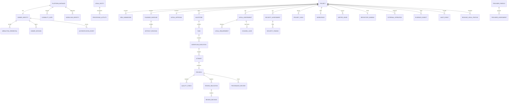

# Builder Platform V1 Data Model

Status: `OWNER APPROVED FOUNDATION BASELINE`

This is the approved logical relational model for `FOUNDATION`. It does not itself perform or authorize a code change; implementation occurs only through a separate one-task workflow.

The selected reversible MVP physical mapping is PostgreSQL 18 for control state and jobs, a local encrypted content-addressed object store, a DPAPI-backed local `SecretBrokerPort`, QEMU/WHPX workspace handles, and encrypted restic snapshots in an approved S3-compatible EU bucket. The logical model remains provider-neutral.

## 1. Modeling Principles

1. One `PlatformInstance` and exactly one active human `OwnerIdentity` exist in V1.
2. There is no human tenant, team, membership, or custom-role administration model.
3. Every project-owned record carries opaque `project_id`.
4. Cross-project relations use composite foreign keys such as `(project_id, task_id)`.
5. Composite keys are supplemented by command authorization, project-scoped repositories/queries, PostgreSQL `FORCE ROW LEVEL SECURITY`, project-bound object capabilities, and negative tests.
6. Mutable aggregate state uses optimistic versions and guarded transitions.
7. Artifacts, decisions, revisions, assessments, evidence, and audit events are append-oriented; supersession never rewrites history.
8. Secret values are not data-model fields. Only opaque broker references exist.
9. Raw prohibited customer data is rejected before persistence. Suspected persisted content opens a hold and deletion/incident workflow.
10. Evidence is minimized and separated from erasable identity mappings where lawful.

## 2. Entity Overview

## 3. Platform and Identity

### `PlatformInstance`

Fields: `id`, `state_version`, `created_at`, `emergency_hold`, `current_policy_set_id`.

Constraints:

- singleton;
- capability state is not inferred from files once an approved runtime migration exists;
- through M-000, `PROJECT_STATE.md` is authoritative; after the audited M-001 migration, the database is authoritative and the file is a generated read-only mirror.

### `OwnerIdentity`

Fields: `id`, `external_subject`, `status`, `mfa_policy_id`, `created_at`, `disabled_at`.

Constraints:

- partial unique constraint permits exactly one active owner;
- no password, recovery secret, authenticator private material, or session token stored here;
- high-risk commands reference a recent `AuthenticationEvent`.

Decision D-020 requires two enrolled WebAuthn authenticators before high-risk gates become eligible: Windows Hello and an independent FIDO2 hardware key. Authenticator public keys, credential IDs, counters, transports, attestation policy, lifecycle state, and enrollment evidence are stored; private key material never enters Builder storage. High-risk commands reference a successful assertion no more than five minutes old.

### `WebAuthnCredential`

Fields: `id`, `owner_id`, `credential_id`, `public_key`, `authenticator_class`, `aaguid`, `sign_count`, `transports`, `attestation_policy_version`, `state`, `enrolled_at`, `last_used_at`, `revoked_at`, `evidence_id`.

Constraints require at least one active platform credential and one active independent roaming credential before architecture, provider, GitHub, execution, export, deletion, recovery, or emergency-enable commands can become eligible. Removing or replacing either credential requires a fresh assertion from the other and creates an audit event.

### `OwnerSession`

Fields: `id_hash`, `owner_id`, `created_at`, `last_activity_at`, `absolute_expires_at`, `idle_expires_at`, `rotated_from_hash`, `revoked_at`, `csrf_binding_hash`, `client_context_hash`.

The raw session and CSRF values are never persisted or logged. Sessions rotate after authentication and privileged actions, expire after 15 minutes idle or 8 hours absolute, and cannot survive break-glass recovery.

### `AuthenticationEvent`

Fields: `id`, `owner_id`, `method`, `assurance_level`, `occurred_at`, `expires_at`, `session_id_hash`, `result`, `evidence_id`.

### `WorkloadIdentity`

Fields: `id`, `component`, `environment_class`, `status`, `policy_version`, `created_at`, `rotated_at`.

Components include API, workflow, outbox, control worker, execution worker, review worker, quality supervisor, workspace manager, Codex broker, GitHub adapter, evidence writer, audit checkpoint, privacy worker, backup, and handoff adapter.

Service identities are not human owners. Their grants are external IAM/policy records referenced by `policy_version`.

### PostgreSQL Authorization Policy

Every project-scoped table enables and forces RLS. Runtime roles are `NOBYPASSRLS`, never own tables, and can see rows only where `project_id` equals the transaction-local context installed after validation of a signed project capability. A separate `NOLOGIN` role owns schemas, tables, and policies. Migration authority is disabled in normal operation and is activated only with workers stopped, fresh owner authentication, a signed migration manifest, and audit evidence.

Global queue claiming is available only through a narrow security-definer function with pinned `search_path`, fixed worker-type checks, atomic claim evidence, and a returned project-bound capability. Runtime roles have no direct cross-project queue access. API, domain, SQL, object, workspace, log, evidence, backup, and restore tests must reject swapped project identifiers and forged/missing transaction context.

### `CapabilityGate`

Fields: `name`, `value`, `version`, `changed_by`, `changed_at`, `reason`, `evidence_id`.

Gate names: architecture approval, implementation, GitHub, automatic execution, and production deployment.

Constraints:

- V1 production gate accepts only `DISABLED`;
- changing high-risk gates needs fresh owner authentication and expected version;
- emergency revoke is always permitted to a safer state.

## 4. Legal and Privacy Control Plane

### `LegalEntity`

Fields: `id`, `legal_name`, `jurisdiction`, `registered_address_ref`, `contact_ref`, `effective_from`, `effective_to`.

`OwnerIdentity` is not assumed to be the controller. The operating legal entity is modeled separately.

### `ProcessingActivity`

Fields: `id`, `legal_entity_id`, `purpose`, `legal_basis`, `data_subject_categories`, `data_categories`, `special_category_flag`, `recipient_categories`, `retention_policy_id`, `security_policy_id`, `transfer_profile_id`, `status`, `version`.

Supports the processing inventory/Article 30 record. Free text is minimized and separately classified.

### `ProviderProfile`

Fields: `id`, `provider`, `product`, `contracting_entity`, `service_region`, `purpose`, `status`, `version`.

### `ProviderAssessment`

Fields: `id`, `provider_profile_id`, `scope_digest`, `dpa_evidence_id`, `subprocessor_evidence_id`, `retention_evidence_id`, `training_use_evidence_id`, `deletion_evidence_id`, `incident_terms_evidence_id`, `valid_from`, `expires_at`, `decision`, `reviewer_id`.

### `TransferAssessment`

Fields: `id`, `provider_assessment_id`, `origin_region`, `destination_regions`, `mechanism`, `adequacy_or_scc_evidence_id`, `tia_evidence_id`, `supplementary_measures_id`, `valid_from`, `expires_at`, `decision`.

Unknown, expired, or ineffective assessment creates an external-processing hold.

### `RetentionPolicy`

Fields: `id`, `record_class`, `purpose`, `legal_basis`, `active_duration`, `backup_expiry`, `deletion_method`, `legal_hold_behavior`, `provider_erasure_required`, `version`.

### `DeletionCase`

Fields: `id`, `project_id`, `scope`, `requester`, `reason`, `state`, `policy_id`, `started_at`, `completed_at`, `result_evidence_id`.

Each result records primary rows, identity mappings, objects, workspaces, repositories/provider references, indexes, replicas, and backup expiry. A legal hold narrows or blocks deletion with evidence.

### `DataSubjectRequest`

Fields: `id`, `legal_entity_id`, `request_type`, `identity_verification_ref`, `scope`, `received_at`, `deadline`, `state`, `decision`, `response_evidence_id`.

### `BreachCase`

Fields: `id`, `awareness_at`, `scope`, `personal_data_categories`, `risk_assessment`, `authority_notification_due`, `authority_decision`, `subject_notification_decision`, `state`, `evidence_id`.

### `AISystemRecord`

Fields: `id`, `system_name`, `intended_purpose`, `provider_deployer_role`, `prohibited_practice_screen`, `risk_class_screen`, `transparency_profile`, `ai_literacy_evidence_id`, `legal_date`, `version`, `state`.

### `ReleaseLegalProfile`

Fields: `id`, `project_id`, `revision_digest`, `distribution_class`, `target_jurisdictions`, `business_model`, `b2c_flag`, `regulated_domain`, `cra_role`, `product_liability_profile`, `bfsg_profile`, `ddg_tdddg_profile`, `decision`, `evidence_id`.

Unknown material scope produces `COUNSEL_REQUIRED`.

## 5. Project and Planning

### `Project`

Fields: `id`, `project_type`, `phase`, `version`, `current_baseline_id`, `canonical_revision_digest`, `created_at`, `archived_at`.

Constraints:

- `project_type = FULL_STACK_WEB` in V1;
- names and paths are never authorization keys;
- a project cannot be executable before `InitialApproval`.

### `IdeaSubmission`

Fields: `id`, `project_id`, `redacted_text_object_id`, `schema_version`, `classification`, `screening_evidence_id`, `accepted_at`.

Rejected raw content is not durably stored. Accepted content must be classified synthetic-only and secret-free.

### `PlanningBaseline`

Fields: `id`, `project_id`, `ordinal`, `digest`, `state`, `created_at`, `frozen_at`, `supersedes_id`.

States: `DRAFT`, `FROZEN`, `APPROVED`, `SUPERSEDED`.

Approved baseline content is immutable. A material change creates a successor baseline and hold.

### `ArtifactRevision`

Fields: `id`, `project_id`, `baseline_id`, `artifact_type`, `schema_version`, `digest`, `evidence_object_id`, `created_by_role`, `created_at`.

Types: specification, architecture, roadmap, and task set.

### `InitialApproval`

Fields: `id`, `project_id`, `baseline_digest`, `owner_id`, `authentication_event_id`, `policy_snapshot_id`, `created_at`, `evidence_id`.

Unique constraint: one row for `(project_id, INITIAL_PROJECT)`.

### `ChangeApproval`

Fields: `id`, `project_id`, `predecessor_baseline_digest`, `successor_baseline_digest`, `owner_id`, `authentication_event_id`, `security_assessment_id`, `legal_assessment_id`, `policy_snapshot_id`, `created_at`, `evidence_id`.

A material post-approval change requires a new row. It is not another initial approval and cannot reuse stale Security/Legal evidence.

### `Milestone`

Fields: `id`, `project_id`, `planner_m_id`, `ordinal`, `state`, `acceptance_policy_id`, `version`.

Serialization is enforced by a lease/unique active constraint within the D-003 scope.

### `Task`

Fields: `id`, `project_id`, `milestone_id`, `specification_version`, `task_type`, `statement_ref`, `acceptance_criteria_ref`, `state`, `repair_count`, `version`.

Constraints:

- `repair_count` is `0..3`;
- task is independently actionable;
- scope change creates a new version/task and never resets history.

### `TaskDependency`

Fields: `project_id`, `predecessor_task_id`, `successor_task_id`.

Same-project only and acyclic.

### `StackProfile`

Fields: `id`, `version`, `frontend`, `server_runtime`, `database`, `package_manager`, `toolchain_manifest_id`, `supported_from`, `supported_until`, `state`.

The only active V1 profile is TypeScript, Next.js, PostgreSQL, pnpm, TypeScript compiler, ESLint, Vitest, Playwright, and production build. Projects reference the exact profile version.

### `PolicySnapshot`

Fields: `id`, `policy_set_version`, `stack_profile_id`, `agent_policy_id`, `network_policy_id`, `resource_policy_id`, `supply_chain_policy_id`, `retention_policy_id`, `content_digest`, `created_at`.

Referenced snapshots are immutable; policy changes create a successor.

### `SupplyChainPolicy`

Fields: `id`, `version`, `allowed_registries`, `lifecycle_script_policy`, `license_allowlist`, `sbom_format`, `critical_vulnerability_action`, `high_vulnerability_action`, `created_at`.

## 6. Workflow, Attempts, and Revisions

### `ProcessInstance`

Coordinates a multi-task lifecycle such as planning without violating the one-task workflow rule.

Fields: `id`, `project_id`, `process_type`, `phase`, `version`, `policy_snapshot_id`.

### `WorkflowExecution`

Fields: `id`, `project_id`, `task_id`, `state`, `policy_snapshot_id`, `version`, `requested_by`, `created_at`, `terminal_at`.

Constraint: exactly one non-null `task_id`; there is no workflow-to-many-tasks relation.

### `Attempt`

Fields: `id`, `project_id`, `task_id`, `workflow_execution_id`, `kind`, `ordinal`, `state`, `base_revision_digest`, `output_revision_digest`, `created_at`, `terminal_at`.

Constraints:

- one `INITIAL` ordinal `0`;
- `REPAIR` ordinal `1..3`;
- unique `(project_id, task_id, ordinal)`;
- infrastructure retry retains the same attempt ID.

### `AgentRun`

Fields: `id`, `project_id`, `attempt_id`, `role`, `provider_profile_id`, `adapter_version`, `sdk_runtime_version`, `model_policy_id`, `provider_thread_ref`, `state`, `started_at`, `terminal_at`.

No raw credential, prompt body, or unrestricted provider event is stored.

### `Revision`

Fields: `id`, `project_id`, `task_id`, `attempt_id`, `parent_digest`, `content_digest`, `local_vcs_commit`, `scan_policy_id`, `sealed_at`.

Immutable and unique within project. Promotion references `content_digest`, never a mutable path.

### `WriterLease`

Fields: `id`, `project_id`, `task_id`, `attempt_id`, `writer_mode`, `holder_identity_id`, `fence_token`, `state`, `expires_at`, `cell_handle`, `revoked_at`.

Constraints:

- partial unique constraint on one active lease per project;
- monotonic fence token;
- expiry alone does not make a new grant safe;
- `writer_mode` is `EXECUTOR` or explicitly authorized `QA_WRITER`.

### `CancellationRequest`

Fields: `id`, `project_id`, `workflow_execution_id`, `attempt_id`, `requested_by`, `reason`, `state`, `requested_at`, `acknowledged_at`, `termination_evidence_id`.

The normative extension for Completion/Cancellation ordering and `RuntimeTerminationEvidence` is `docs/architecture/cancellation-contract-decision-01.md`. `CancellationRequest.state` must distinguish at least accepted cancellation from `REJECTED_TOO_LATE`. `termination_evidence_id` may authorize `CANCELLED` only when it references an immutable verifier decision with `validity=VALID` bound to the exact project, runtime, agent run, attempt, job, workload/process identity, cancellation sequence, lease generation, and fencing token. A caller-supplied confirmation kind or terminal status string is not evidence. Runtime observation and authoritative result disposition are separate so that an observed late `SUCCEEDED` can remain append-only while its result is `LATE_RESULT_DISCARDED`.

## 7. Quality and Review

### `ToolchainManifest`

Fields: `id`, `stack_profile_id`, `version`, `manifest_digest`, `signer_identity_id`, `test_descriptor`, `typecheck_descriptor`, `lint_descriptor`, `build_descriptor`, `limits_policy_id`, `created_at`.

Descriptors are structured, not interpolated shell strings.

### `QualityRun`

Fields: `id`, `project_id`, `revision_id`, `toolchain_manifest_id`, `runner_image_digest`, `policy_snapshot_id`, `state`, `attestation_evidence_id`.

### `QualityCheck`

Fields: `id`, `project_id`, `quality_run_id`, `revision_id`, `check_type`, `state`, `exit_status`, `resource_summary`, `evidence_id`, `attester_identity_id`.

Unique current check types per revision: test, typecheck, lint, build.

### `ReviewObligation`

Fields: `id`, `project_id`, `revision_id`, `role`, `policy_version`, `state`, `assigned_identity_id`.

Unique roles per revision: QA, Reviewer, Security, Legal.

### `ReviewDecision`

Fields: `id`, `project_id`, `obligation_id`, `revision_id`, `disposition`, `evidence_id`, `completed_at`, `reviewer_identity_id`.

Immutable. A QA writer identity for the revision cannot be its QA reviewer.

### `ProvenanceRecord`

Fields: `id`, `project_id`, `revision_id`, `subject_type`, `subject_path_hash`, `origin_type`, `origin_ref`, `license_expression`, `notice_required`, `finding_state`, `evidence_id`.

### `SBOMRecord`

Fields: `id`, `project_id`, `revision_id`, `format`, `document_digest`, `generator_identity`, `evidence_id`, `created_at`.

## 8. Legal and Security Assessments

### `LegalAssessment`

Fields: `id`, `project_id`, `scope_type`, `scope_id`, `revision_digest`, `status`, `facts_digest`, `assumptions_ref`, `jurisdictions`, `legal_date`, `source_set_id`, `reviewer_type`, `evidence_id`, `supersedes_id`, `finalized_at`.

Status constraint accepts exactly:

- `PASS`
- `PASS_WITH_REQUIREMENTS`
- `BLOCK`
- `COUNSEL_REQUIRED`

Missing/stale/conflicting data creates a `LEGAL_UNRESOLVED` hold rather than a fifth assessment status.

### `LegalRequirement`

Fields: `id`, `project_id`, `assessment_id`, `requirement_ref`, `state`, `submitted_evidence_id`, `verification_evidence_id`, `verified_by`, `verified_at`.

States: `OPEN`, `EVIDENCE_SUBMITTED`, `VERIFIED`, `REJECTED`, `SUPERSEDED`.

### `CounselCase`

Fields: `id`, `project_id`, `assessment_id`, `state`, `qualified_counsel_identity_ref`, `encrypted_decision_evidence_id`, `opened_at`, `closed_at`.

The old assessment is never mutated. Legal issues a successor assessment after accepting counsel evidence.

### `SecurityAssessment`

Fields: `id`, `project_id`, `scope_type`, `scope_id`, `revision_digest`, `policy_version`, `state`, `evidence_id`, `finalized_at`.

### `SecurityFinding`

Fields: `id`, `project_id`, `assessment_id`, `fingerprint`, `affected_digest`, `severity`, `state`, `owner`, `evidence_id`.

Unknown severity is `UNCLASSIFIED` and blocking. Finding history is append-only in `FindingEvent`.

### `ProjectHold`

Fields: `id`, `project_id`, `hold_type`, `scope`, `state`, `source_record_type`, `source_record_id`, `created_at`, `clearing_evidence_id`, `cleared_at`.

Types include Legal unresolved, `BLOCK`, counsel, critical/unclassified Security, evidence integrity, provider/transfer expiry, prohibited data, cancellation stuck, repository drift, and emergency.

No initial approval or `ManualDecision` clears a binding hold.

## 9. Workspaces and External Operations

### `Workspace`

Fields: `id`, `project_id`, `opaque_handle`, `state`, `isolation_policy_id`, `encryption_context_ref`, `canonical_revision_digest`, `created_at`, `archived_at`.

Unique active canonical workspace per project; only after approval.

### `ExternalOperation`

Fields: `id`, `project_id`, `provider`, `operation_type`, `logical_target`, `idempotency_key`, `desired_digest`, `state`, `provider_receipt_ref`, `prepared_at`, `observed_at`.

Unique logical provider operation. Unknown result enters reconciliation.

### `RepositoryBinding`

Fields: `id`, `project_id`, `provider_profile_id`, `external_owner_id`, `external_repository_id`, `visibility`, `configuration_digest`, `drift_state`, `created_at`.

Constraints:

- one active binding per project;
- provider repository ID globally unique;
- default visibility private;
- publication-risk configuration drift opens a hold.

### `DeploymentHandoff`

Fields: `id`, `project_id`, `revision_digest`, `target_class`, `destination_profile_id`, `state`, `manifest_evidence_id`, `created_at`.

`target_class` rejects `PRODUCTION` and `UNKNOWN` as executable states.

## 10. Jobs, Idempotency, Evidence, and Audit

### `Job`, `OutboxEvent`, and `InboxReceipt`

Jobs contain typed identifiers only. An outbox row is written with the domain transition. Inbox uniqueness is `(consumer_identity, message_id)`.

### `IdempotencyRecord`

Fields: `actor_scope`, `idempotency_key`, `request_digest`, `result_ref`, `created_at`, `expires_at`.

Same key/different digest is rejected.

### `EvidenceObject`

Fields: `id`, `project_id`, `classification`, `object_key`, `content_digest`, `size`, `media_type`, `scan_policy_id`, `scan_state`, `redaction_state`, `retention_policy_id`, `finalized_at`.

Append-only metadata; finalized immutable object required before gate use.

### `AuditEvent`

Fields: `id`, `project_id`, `aggregate_type`, `aggregate_id`, `aggregate_sequence`, `actor_identity_id`, `transition`, `prior_state`, `new_state`, `reason_code`, `policy_version`, `evidence_refs`, `idempotency_key`, `occurred_at`, `previous_event_hash`, `event_hash`.

### `AuditCheckpoint`

Fields: `id`, `sequence_start`, `sequence_end`, `merkle_or_chain_root`, `signed_by`, `signature`, `trusted_timestamp_ref`, `external_anchor_ref`, `created_at`, `verification_state`.

Checkpoints are required every 15 minutes and before/after high-risk transitions. `trusted_timestamp_ref` identifies an RFC-3161 response bound to the checkpoint root. The external object key is unique and immutable under 12-month Compliance-mode Object Lock; only minimized integrity metadata is anchored.

### `KeyWrap`

Fields: `id`, `key_subject_type`, `key_subject_id`, `wrap_method`, `wrap_key_ref`, `ciphertext`, `algorithm`, `version`, `state`, `created_at`, `verified_at`, `retired_at`, `evidence_id`.

Backup repository keys require both an active DPAPI online wrap and an active PIV disaster-recovery wrap. PIV private material, token PINs, and plaintext data keys are never stored. Restore verification must prove the wrap metadata and a successful hardware-present recovery drill before backup capability activation.

### `BackupProfile`

Fields: `id`, `backend_type`, `provider_profile_id`, `region`, `repository_ref`, `schedule`, `retention_policy_id`, `encryption_key_ref`, `object_lock_mode`, `rpo_target`, `rto_target`, `state`, `version`.

Selected values are S3-compatible EU region, daily restic snapshots, 30-day backup retention, RPO 24 hours, RTO 8 hours, DPAPI online wrap, and PIV disaster-recovery wrap. The profile remains ineffective until provider/transfer assessment and a recovery drill pass.

### `BackupSnapshot`

Fields: `id`, `backup_profile_id`, `snapshot_ref`, `source_manifest_digest`, `started_at`, `completed_at`, `state`, `verification_evidence_id`, `expires_at`.

Restore never writes directly to live state; it creates a quarantined `RestoreCase`.

### `RestoreCase`

Fields: `id`, `backup_snapshot_id`, `requested_by`, `state`, `quarantine_location_ref`, `audit_verification`, `tombstone_verification`, `credential_verification`, `provider_binding_verification`, `result_evidence_id`.

### `Notification`

Fields: `id`, `project_id`, `event_type`, `severity`, `owner_inbox_state`, `windows_toast_state`, `created_at`, `acknowledged_at`, `evidence_id`.

Acknowledgement is never approval. No timeout changes a gate.

### `SecretReference`

Fields: `id`, `broker`, `opaque_reference`, `purpose`, `audience`, `project_id`, `version`, `expires_at`, `status`.

For the selected MVP, `broker` identifies the local DPAPI-backed service and `opaque_reference` never contains DPAPI ciphertext or a raw key. The database must reject API fields intended to carry raw secret values. Production-purpose references do not exist for agent or handoff identities.

## 11. Principal Database Constraints

| Constraint | Purpose |
|---|---|
| One active owner | FR-023 |
| One initial approval/project | FR-005 |
| Workspace requires approval FK/digest | FR-006/007 |
| One task/workflow | FR-009 |
| One active writer/project | FR-011 |
| Attempt ordinal initial 0 or repair 1..3 | FR-016/017 |
| Repair count `0..3` and unique task ordinal | NFR-009 |
| Four quality types and four review roles/revision | FR-013..015 |
| Exact Legal enum | FR-018 |
| QA writer cannot be QA reviewer | D-013 |
| Project-scoped composite FKs | FR-029 |
| Production/unknown handoff denied | FR-026 |
| Append-only finalized decisions/evidence/audit | FR-028 |
| External operation logical uniqueness | NFR-013 |
| Current policy/digest checks on gate references | NFR-008/010 |

## 12. Data Lifecycle

Selected MVP defaults:

- transient rejected intake: no durable retention;
- cancelled partial attempt: quarantine up to 24 hours unless an incident hold applies;
- deleted local project content: 7-day soft-delete followed by crypto-erasure when no hold applies;
- encrypted EU backup snapshots: 30 days;
- minimized audit evidence: 12 months;
- GitHub repository: no automatic delete; separate fresh owner action only;
- RPO: 24 hours; RTO: 8 hours;
- counsel evidence: separately encrypted and unavailable to agents/providers;
- OpenAI/Codex receives only minimized synthetic project context after the exact provider gate is effective.

The concrete EU backup provider, Object Lock behavior, contract/DPA, transfer evidence, provider erasure, restore drill, and DPAPI key recovery remain conditional activation gates. They do not leave an architecture choice open: failure keeps the affected capability `NO`. No automatic archive, external processing, provider enablement, or deletion may run before its evidence gate is effective.
