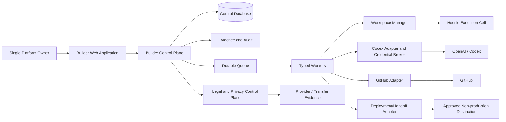
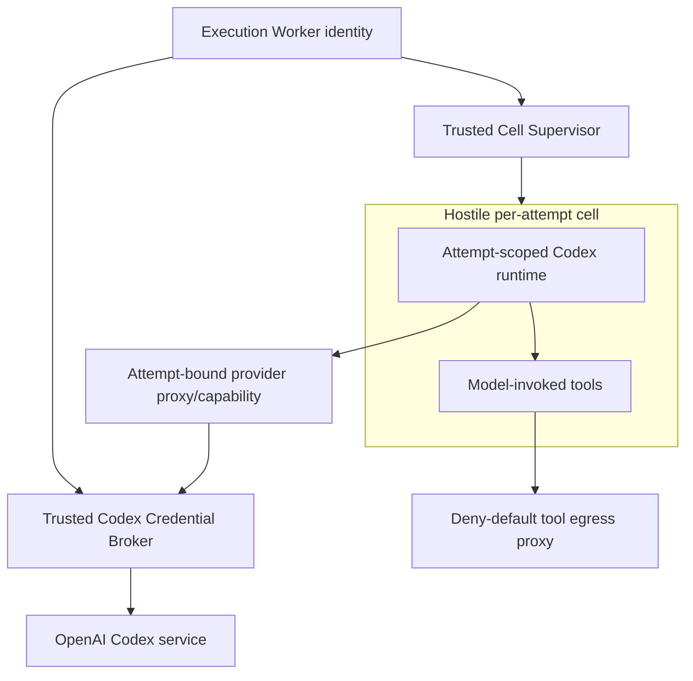
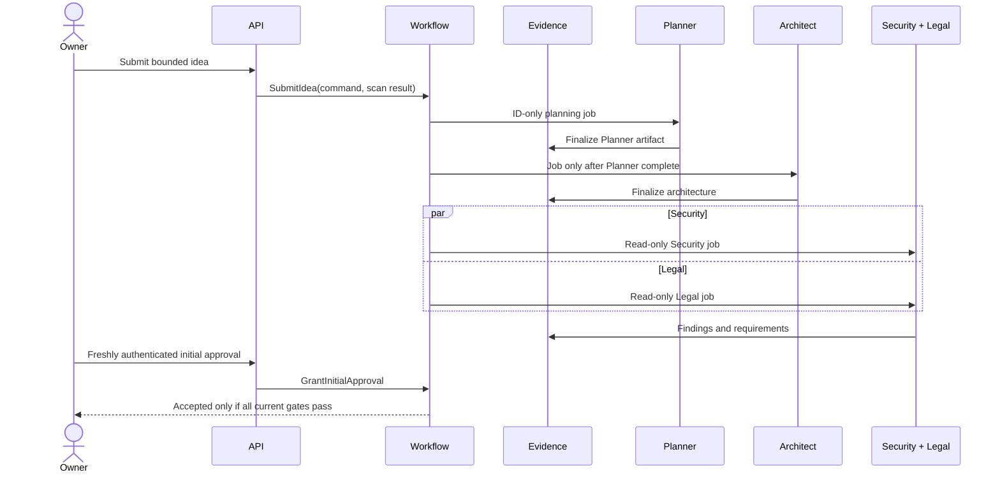
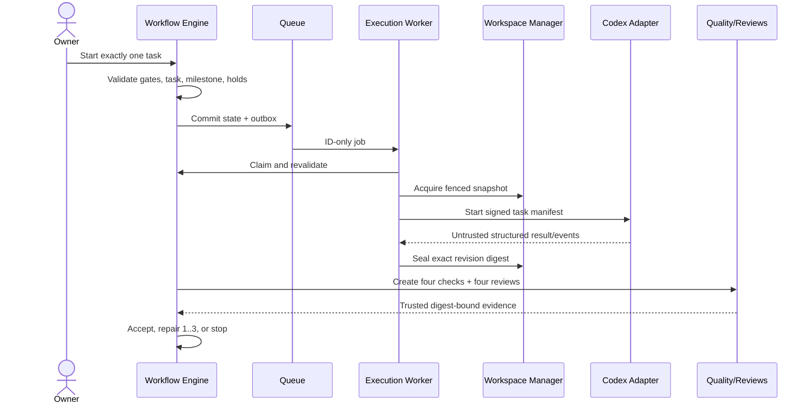
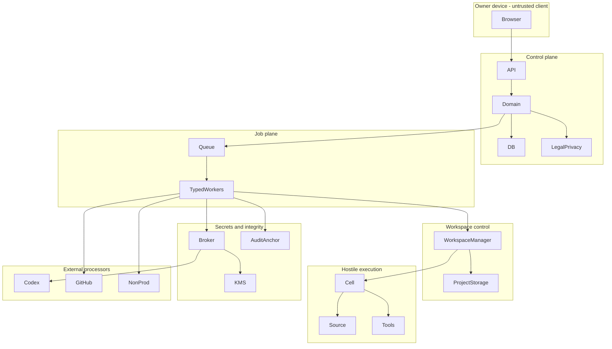

# Builder Platform V1 System Design

Status: `OWNER APPROVED FOR FOUNDATION - SECURITY ACCEPTED_WITH_IMPLEMENTATION_GATES - LEGAL PASS_WITH_REQUIREMENTS`

This document enables nothing by itself. `PROJECT_STATE.md` is authoritative: architecture and the single `FOUNDATION` implementation milestone are enabled; GitHub and automatic execution are `NO`; production is `DISABLED`. This review authorizes no application-code edit.

## 1. Design Goals

The architecture must:

1. turn one owner's supported idea into versioned planning artifacts;
2. enforce the Planner -> Architect -> parallel Security/Legal sequence;
3. prevent any generated-project filesystem or code before one initial approval;
4. run exactly one task and one source writer per project at a time;
5. treat inputs, repositories, models, dependencies, tools, and execution cells as hostile;
6. make every gate and side effect durable, attributable, idempotent, and fail closed;
7. bind quality, review, Legal, and Security evidence to an immutable digest;
8. prevent direct and indirect production access by architecture, IAM, repository settings, and network policy;
9. support German/EU privacy, provider, transfer, retention, AI, IP/OSS, and release controls;
10. remain operationally small enough for V1 without collapsing trust boundaries.

### Binding Architecture Invariants

| ID | Invariant |
|---|---|
| AI-001 | No executable generated-project directory, local project repository, or application source exists before the project's one valid initial approval. |
| AI-002 | Every `WorkflowExecution` references exactly one non-null task; multi-task lifecycle coordination uses a separate `ProcessInstance`. |
| AI-003 | At most one active source-writing lease and one fenced RW mount exist per project; the scope includes Executor and QA Writer. |
| AI-004 | Only an authorized Executor or explicitly assigned QA Writer may change application source. |
| AI-005 | Planner, Architect, Security, Legal, Reviewer, and QA Reviewer receive no writable application-source mount. |
| AI-006 | The initial implementation has ordinal `0`; automatic repair ordinals are exactly `1`, `2`, and `3`. |
| AI-007 | Infrastructure retries retain the same attempt identity and never increment the repair counter. |
| AI-008 | Every changed revision creates new test, typecheck, lint, build, QA, Reviewer, Security, and Legal obligations. |
| AI-009 | Evidence and decisions bind an immutable revision digest; evidence for another digest is ineffective. |
| AI-010 | Missing, malformed, stale, conflicting, unknown, or unavailable gate data denies progression. |
| AI-011 | `BLOCK` stops continuation and publication. `COUNSEL_REQUIRED` stops publication and, under the conservative interim policy, automated continuation. |
| AI-012 | An unresolved critical or unclassified Security finding stops publication until verified closure on current evidence. |
| AI-013 | An earlier approval or manual decision cannot clear a later Legal, Security, provider, evidence-integrity, or production hold. |
| AI-014 | Every project-owned record and capability carries opaque `project_id`; cross-project relationships use composite keys plus project authorization. |
| AI-015 | Queue messages contain identifiers and policy/schema versions only, never source, prompts, artifacts, customer data, Legal advice, or secret values. |
| AI-016 | Agents cannot directly access the control database, queue administration, secret broker, GitHub, or deployment/handoff provider. |
| AI-017 | Production deployment has no enabled state, credential, endpoint, IAM grant, network route, repository trust, or adapter operation in V1. |
| AI-018 | A disabled capability is rechecked at command acceptance, job claim, credential issue, side-effect dispatch, and reconciliation. |
| AI-019 | Promotion by the trusted Workspace Manager is a compare-and-swap update to an accepted content-addressed revision, not an agent source edit. |
| AI-020 | Real customer data is prohibited throughout V1; suspected content fails closed before persistence or external transmission. |

## 2. Reconciled Architecture Decisions

The reviews changed the proposed architecture as follows:

| Reconciliation | Final design treatment |
|---|---|
| Security questioned directory/container-only isolation | A microVM or independently justified equivalent is the required hostile-code boundary. SDK sandboxing is defense in depth only. |
| Codex SDK may expose inherited environment/session data to child tools | A trusted Codex Credential Broker remains outside the cell. The cell receives only a short attempt-bound capability or narrow proxy operation. |
| A deployment port alone did not prevent indirect production through GitHub | Dedicated repository ownership, disabled Actions/Pages/releases/packages/OIDC/environments, drift reconciliation, IAM and network denial are part of the production boundary. |
| Append-only SQL was insufficient audit integrity | Add dedicated audit-writer identity, immutable/versioned object retention, signed ordered checkpoints, an independently administered anchor, restore/gap detection, and trusted time. |
| Composite project foreign keys were insufficient authorization | Enforce project context in API/domain/storage plus PostgreSQL `FORCE ROW LEVEL SECURITY`, project-bound capabilities, per-project encryption/path policy, and negative tests. |
| Cell-reported check results were untrusted | Add a Trusted Quality Supervisor and signed Toolchain Manifest; only supervisor-attested evidence can pass a quality gate. |
| One human owner could be mistaken for one system identity | Retain one human owner but use distinct workload identities for every service and fresh phishing-resistant owner authentication for sensitive commands. |
| Data/controller/provider obligations were implicit | Add a Legal and Privacy Control Plane with processing inventory, provider/transfer gates, retention/deletion, DSR/breach, AI register, release profile, provenance, and counsel cases. |
| Immutable evidence could conflict with erasure | Store minimized evidence; separate erasable identity mappings; apply record-specific retention, legal holds, provider erasure, tombstones, and crypto-erasure where approved. |

## 3. Architectural Style

V1 uses a **modular control-plane monolith** with separately deployed web/API and worker processes. It shares one transactional domain and relational database while preserving workload identities, network boundaries, and capability-specific worker processes.

This is preferred to early microservices because repair counters, unique approval, writer fencing, idempotency, and gate transitions benefit from one transactional boundary. Execution, secrets, evidence anchoring, external providers, and hostile workspaces remain separate security systems.

### Baseline

| Concern | Baseline |
|---|---|
| Owner experience | Server-backed web application and API/BFF |
| Domain state | Transactional relational database with constraints and aggregate versions |
| Workflow | Explicit persisted state machines plus transactional outbox/inbox |
| Jobs | At-least-once durable ID-only delivery; queue grants no authority |
| Evidence | Immutable project-scoped object storage plus relational metadata and signed checkpoints |
| Workers | Control, execution, review, quality, reconciliation, audit, privacy, and notification identities |
| Workspace | One canonical project store after approval; copy-on-write disposable attempt snapshots |
| Execution | Disposable microVM or approved equivalent per attempt/review activity |
| Agents | Builder-owned deterministic workflow; provider adapters cannot own gates |
| Secrets | Dedicated broker/KMS and opaque references only |
| GitHub | GitHub App, private dedicated repository, brokered short-lived installation token |
| Deployment | Metadata/package export or explicitly approved non-production handoff only |
| Observability | Metadata allowlist; no raw source, prompts, Legal advice, secrets, or customer data |

### Selected Local Windows MVP Profile

This profile records the binding owner decisions and reversible technical MVP decisions approved as the V1 `FOUNDATION` baseline:

| Concern | Selected MVP treatment |
|---|---|
| Usage | Private internal tool used only by the owner in Germany/EU |
| Host | Current local Windows Home machine |
| Control plane | Native local TypeScript/Node modular monolith with separate worker processes, bound to loopback |
| Database and queue | PostgreSQL 18; transactional outbox/inbox and PostgreSQL job table using ordered `FOR UPDATE SKIP LOCKED` claims |
| Artifact/evidence storage | Local encrypted content-addressed store with project-scoped envelope keys |
| Execution isolation | QEMU Linux VMs accelerated by Windows Hypervisor Platform; disposable differencing disk per attempt |
| Secret broker | Trusted Windows service, DPAPI online wraps, PIV backup-recovery wrap, ACL-restricted named-pipe port, per-project data keys |
| Backup | Encrypted restic repository on an S3-compatible EU-region provider; provider Legal gate required |
| GitHub | Dedicated private organization and GitHub App; risky publication/production features disabled |
| OpenAI/Codex | Controlled external processing only after the product-specific provider gate is effective |
| Login | Loopback-only WebAuthn: Windows Hello primary passkey plus one independent FIDO2 hardware key; short sessions and fresh assertions for high-risk actions |
| Handoff | Local or encrypted owner export only; no hosted preview or deployment |

QEMU documents WHPX as its Windows Hypervisor Platform acceleration backend and requires the Windows Hypervisor Platform feature ([QEMU WHPX documentation](https://www.qemu.org/docs/master/system/whpx.html)). Hardware virtualization, WHPX availability, VM teardown, device isolation, and hostile-guest tests are mandatory prerequisites. There is no WSL, ordinary-container, or software-emulation security fallback.

## 4. Context Diagram

## 5. Components

### 5.1 Builder Web Application

Responsibilities:

- sole-owner authentication and session status;
- bounded idea intake with pre-persistence screening;
- versioned planning-artifact rendering and diff;
- project, milestone, task, workflow, and repair status;
- revision-bound quality/review evidence;
- Security and Legal holds, requirements, and counsel state;
- one initial approval and high-risk manual commands after fresh reauthentication;
- provider, retention, release-profile, and capability-gate evidence;
- owner inbox and audit queries.

Security posture:

- no direct database, queue, workspace, provider, or filesystem access;
- context-aware escaping, sanitized Markdown, restrictive CSP, Trusted Types where supported;
- previews on an isolated origin with sandboxing and no Builder session cookie;
- CSRF defense for every mutation;
- no UI inference of success from a stream; authoritative state is reloaded.

### 5.2 API/BFF and Identity

The API authenticates the one owner and validates every command. It does not provide human team/RBAC administration. It does use workload identities internally.

The binding target requires fresh phishing-resistant authentication for:

- initial approval;
- capability-gate change;
- provider enablement;
- GitHub operation;
- export/publication-like action;
- retention deletion or legal-hold change;
- recovery or emergency re-enable.

The Builder binds to a single local TLS origin and no LAN listener. Bootstrap is available only to the interactive Windows owner on loopback and completes only after Windows Hello and an independent FIDO2 hardware key are enrolled. There are no passwords, recovery questions, emailed links, or stored recovery codes. Sessions use an opaque rotating `Secure`, `HttpOnly`, `SameSite=Strict` cookie, expire after 15 minutes idle and 8 hours absolute, and are protected by strict `Host`/`Origin` validation and synchronizer CSRF tokens. Approval, capability changes, provider enablement, GitHub operations, export, retention deletion, legal-hold changes, authenticator changes, recovery, and emergency re-enable require a WebAuthn assertion no more than five minutes old. Loss of the primary authenticator uses the second key; loss of both requires a local break-glass rebuild under a new owner bootstrap event and cannot reuse an old session.

### 5.3 Project and Planning Module

Owns projects, idea-validation result, planning baselines, artifact revisions, milestone definitions, atomic tasks, and the planning `ProcessInstance`. It can persist documents before approval but cannot call the Workspace Manager.

### 5.4 Workflow Domain Engine

The only authority for:

- aggregate transitions and versions;
- capability gates and holds;
- one initial approval;
- one-task execution;
- milestone serialization;
- writer lease and fencing state;
- attempt and repair ordinals;
- quality/review obligations;
- acceptance and promotion authorization;
- cancellation and recovery;
- external-operation preparation and reconciliation.

Workers never issue ad hoc state-changing SQL.

### 5.5 Policy and Gate Evaluator

Evaluates current, versioned predicates for:

- owner and workload identity;
- project scope;
- global capability gates;
- baseline approval and current digest;
- provider/transfer contract effectiveness;
- Legal status and open requirements;
- Security classification and holds;
- revision/check/review freshness;
- publication and environment classification;
- resource/tool/network policies.

It cannot create evidence or mutate an assessment to make a gate pass.

### 5.6 Legal and Privacy Control Plane

Owns:

- `LegalEntity` and controller/processor role mapping;
- processing inventory and Article 30 record data;
- purpose/legal-basis/data-category/recipient definitions;
- provider product, DPA, subprocessor, region, retention, training-use, transfer, deletion, and incident evidence;
- DPIA screen and counsel triggers;
- record retention, deletion, backup expiry, and legal holds;
- data-subject requests and personal-data-breach cases;
- AI system register, role/risk/transparency records, and AI literacy evidence;
- release Legal Profile for CRA, product liability, B2C, DDG/TDDDG, BFSG, domains, and jurisdictions;
- provenance, OSS, notices, rights-chain, and SBOM gates;
- `CounselCase` and successor Legal assessments.

It does not provide automated legal advice or authorize itself.

### 5.7 Transactional Database

The selected MVP database is PostgreSQL 18 running locally on Windows. It stores authoritative control state and enforces:

- singleton platform and one active owner;
- unique initial approval per project;
- one task per workflow;
- repair ordinals `0..3`;
- one active source-writer lease per project;
- four required quality types and four review roles;
- exact Legal enum;
- no production deployment target;
- project-scoped composite references and PostgreSQL `FORCE ROW LEVEL SECURITY`;
- append-only decisions, evidence metadata, finding events, and audit sequences.

Details are in `data-model.md`.

Every project-scoped table has `ENABLE ROW LEVEL SECURITY` and `FORCE ROW LEVEL SECURITY`; policies compare `project_id` with a transaction-local project context set only after a signed project capability is validated. Runtime roles are `NOBYPASSRLS`, are not table owners, and have no generic cross-project SQL. A `NOLOGIN` schema owner owns tables and policies. Migration authority is separate, disabled during normal service, and usable only in an owner-authenticated maintenance workflow with workers stopped and audit evidence recorded.

Global dispatch does not grant workers direct queue enumeration. A narrow claim function with a pinned `search_path` validates worker type, selects one eligible project/job atomically, records the claim, and returns a project-bound capability. Subsequent SQL, object, log, workspace, evidence, and backup operations must present that same project context. Direct runtime access to cross-project queue and object indexes is denied.

### 5.8 Outbox, Queue, and Inbox

The same PostgreSQL transaction that mutates domain state writes audit, idempotency, outbox, and job rows. Workers claim ordered eligible rows with `FOR UPDATE SKIP LOCKED`; there is no Redis, RabbitMQ, or separate broker in V1. The dispatcher/worker identities still authenticate and authorize job types, and inbox uniqueness handles duplicate delivery. PostgreSQL explicitly describes `SKIP LOCKED` as suitable for queue-like consumers rather than general-purpose consistent reads ([PostgreSQL locking documentation](https://www.postgresql.org/docs/current/sql-select.html)).

A job carries identifiers, schema/policy versions, idempotency key, expected aggregate version, schedule, delivery count, and trace ID. It carries no source, prompt, secret, customer data, Legal advice, or artifact body. The claimant reloads state and reevaluates gates.

### 5.9 Worker Classes

| Worker | Allowed capability | Explicit denial |
|---|---|---|
| Control Worker | Coordinate workspace and approved adapters | No application shell; no production identity |
| Execution Worker | Request a fenced attempt cell and Codex operation | No arbitrary domain SQL; no cross-project mount |
| Review Worker | Start read-only review cells | No source-write grant |
| Quality Worker | Ask Trusted Quality Supervisor to run manifest | No canonical source mutation |
| Reconciler | Inspect leases, jobs, evidence, external operations, and drift | Cannot infer PASS or clear holds |
| Audit Worker | Append ordered audit/checkpoint data | Cannot rewrite prior events |
| Privacy Worker | Execute approved DSR/deletion/retention tasks | Cannot delete held records |
| Notification Worker | Populate owner inbox and approved channels | Notification never implies approval |

### 5.10 Evidence and Audit System

Evidence flow:

1. Producer uploads to a project-scoped staging area.
2. Trusted service hashes, scans, redacts, classifies, and enforces size/type limits.
3. The exact object is finalized under an immutable, versioned project-scoped key.
4. SQL metadata references the finalized digest.
5. A gate may then reference it.
6. Supersession appends; it does not overwrite.
7. Hash-chained checkpoints are created every 15 minutes and before/after high-risk transitions, signed, RFC-3161 timestamped, and written to a dedicated versioned EU bucket under 12-month Compliance-mode Object Lock. The runtime identity can create only new checkpoint objects; restore/read and retention-administration identities are offline and separate.
8. Sequence gap, bad signature, rollback, missing object, or restore mismatch opens an evidence-integrity hold.

No cross-project content deduplication is permitted. Personal identity linkage is erasable separately from minimized integrity evidence where legally approved.

### 5.11 Workspace Manager

The Workspace Manager is the only component that maps opaque workspace handles to host resources. It provides:

- idempotent post-approval provisioning;
- project-scoped encrypted storage and canonical revision pointer;
- disposable copy-on-write attempt snapshots;
- one fenced RW mount and immutable RO review mounts;
- sealing, scanning, quarantine, promotion by compare-and-swap, archive, and approved deletion;
- actual-cell-death verification before lease reuse.

It accepts no caller-supplied host path.

### 5.12 Hostile Execution Runtime

The selected local backend is QEMU with WHPX and a hardened Linux guest. Required boundary:

- microVM or independently reviewed equivalent;
- disposable root, home, temp, package cache, and Codex session directory;
- non-root execution and restricted syscalls/capabilities/devices;
- no host/runtime socket, control-plane route, metadata service, or shared writable cache;
- explicit CPU, memory, PID, disk, duration, output, token, and cost limits;
- deny-default egress through a destination-aware proxy;
- DNS rebinding, redirect, loopback, private/link-local, IPv4-mapped IPv6, and metadata controls;
- archive, symlink, hard-link, device-file, mount, and path traversal defenses;
- immutable attested base image/toolchain;
- full cell destruction after an attempt or quarantine on ambiguity.

Each attempt starts from an immutable signed base image plus a fresh differencing disk. Clipboard, shared folders, USB/device passthrough, host filesystem mounts, GUI integration, and arbitrary QMP access are disabled. A private virtual switch permits only the narrow Codex proxy and explicitly allowed package proxy. If WHPX or hardware virtualization is unavailable, automatic execution remains disabled.

Repository text, build scripts, packages, model output, and tools are hostile even when the prompt is trusted.

### 5.13 Agent Runtime and Codex Integration

The Builder owns scheduling, gates, counters, budgets, acceptance, and repair decisions. The `CodexAdapter` owns only provider lifecycle and event normalization.

Each run receives a signed manifest containing:

- project/task/workflow/attempt and role;
- exact task and acceptance criteria;
- baseline and expected base digest;
- opaque workspace handle;
- tool, command, egress, resource, token, and time policy IDs;
- output schema and prohibited operations;
- current repair feedback only.

It contains no reusable provider credential, host path, unrelated task, production information, customer data, or secret value.

Required trust topology:

Two implementation profiles are admissible in principle, but neither is approved yet:

1. **Cell-local SDK/CLI:** the Codex SDK/CLI and every model-invoked child process run inside the hostile cell. A trusted external broker retains the reusable provider credential; the cell receives only a short project/attempt/audience-bound capability or talks to a narrow provider proxy.
2. **Trusted external adapter:** the SDK runs outside the cell, but every filesystem, command, and tool operation is delegated to a fenced runner inside the cell. Conformance must prove that no repository-controlled or model-selected code can execute in the trusted adapter process or host namespace.

The exact pinned release must prove that the chosen profile is supported and that child processes cannot access reusable API credentials, auth files, session sockets, ambient worker environment, host tools, or another project's thread. If neither profile can be implemented without weakening those conditions, `Automatic project execution` stays `NO`.

The official Codex SDK supports programmatic local-agent control and the TypeScript SDK wraps Codex CLI behavior. That is an integration fact, not an isolation or exactly-once guarantee. Version-sensitive cancellation, resume, event schema, auth inheritance, and crash recovery require conformance tests against the pinned release. See [Codex SDK](https://developers.openai.com/codex/sdk) and the official [TypeScript SDK source](https://github.com/openai/codex/tree/main/sdk/typescript).

### 5.14 Trusted Quality Supervisor

The quality cell cannot attest itself. A trusted supervisor:

- loads the approved signed Toolchain Manifest;
- invokes exact commands without shell interpolation;
- runs against the sealed immutable revision;
- records runner image, toolchain, manifest, policy, limits, exit status, and digest;
- scans outputs before finalization;
- signs/attests the result through a distinct workload identity;
- never changes the canonical revision.

### 5.15 GitHub Adapter

Selected V1 profile:

- GitHub App in a dedicated private Builder organization selected by the owner;
- one private repository per project;
- KMS-held App private key;
- installation tokens restricted by numeric repository ID and minimum permissions; GitHub documents that installation tokens can be repository- and permission-limited and expire after one hour ([GitHub App installation authentication](https://docs.github.com/en/apps/creating-github-apps/authenticating-with-a-github-app/authenticating-as-a-github-app-installation));
- agents never receive GitHub credentials;
- trusted adapter pushes only an accepted content digest;
- protected default branch and no force/bypass;
- Actions, Pages, releases, packages, production environments, deploy keys, organization secrets, production webhooks, and cloud OIDC trusts disabled by default;
- settings reconciled before push and on webhook drift;
- webhook raw-body HMAC-SHA256 validation, constant-time comparison, delivery-ID dedupe, and binding to expected installation/repository, following [GitHub webhook validation](https://docs.github.com/en/webhooks/using-webhooks/validating-webhook-deliveries);
- uncertain create/push result enters reconciliation before retry.

No GitHub action is permitted until D-010, D-016, D-023, and provider Legal evidence are approved and the gate is explicitly enabled.

### 5.16 Deployment Adapters

The selected V1 port supports only:

- validate an accepted package/digest;
- produce checksums, provenance, SBOM/evidence references, and variable names without values;
- create a handoff manifest;
- export to a local owner-selected folder as an encrypted bundle.

Targets are `LOCAL`, `NON_PRODUCTION`, `EXPORT`, `PRODUCTION`, or `UNKNOWN`. `PRODUCTION` and `UNKNOWN` are rejected by schema, domain, adapter IAM, and network policy. There is no `deployProduction` method.

There is no hosted preview or non-production deployment in the selected MVP. A future externally reachable preview is publication and requires a new Security/Legal gate.

### 5.17 Local Secret and Encryption Broker

The MVP uses a small trusted Windows service behind `SecretBrokerPort`:

- the service account and local named pipe are restricted by Windows ACLs;
- Windows DPAPI protects online master, signing, backup, and provider-key wraps at rest;
- the random restic repository key also has a disaster-recovery wrap to the non-exportable PIV encryption key on the independent hardware authenticator;
- each project receives a random data-encryption key and separate encryption context;
- the database stores only ciphertext, opaque references, versions, audiences, and expiry metadata;
- execution cells receive only short attempt-bound capabilities, never DPAPI material or reusable provider keys;
- no production-purpose secret class exists;
- key access, wrap/unwrap, signing, rotation, and revocation are audited without logging values.

Normal online use is bound to the Windows installation, but backup recovery is not. On a replacement host the owner bootstraps with WebAuthn, inserts the PIV token, supplies its PIN with physical presence, unwraps the repository key, verifies the quarantined restore, and creates a new DPAPI wrap. Neither PIN nor unwrapped key is persisted or logged. `SecretBrokerPort` permits later rewrapping into TPM-backed keys, Vault, or a cloud KMS without changing encrypted project content.

### 5.18 Backup and Restore

The selected backup backend is restic using an S3-compatible bucket in an approved EU region. Restic supports encrypted repositories and S3-compatible services ([restic repository documentation](https://restic.readthedocs.io/en/stable/030_preparing_a_new_repo.html)).

Policy:

- backup client runs under a separate workload identity;
- restic password is supplied by `SecretBrokerPort`, not an environment file;
- daily encrypted snapshots; 30-day backup retention;
- minimized audit checkpoints/evidence retained 12 months;
- target RPO 24 hours and RTO 8 hours;
- signed audit checkpoints use 15-minute and high-risk-boundary cadence, RFC-3161 trusted timestamps, a versioned bucket under 12-month Compliance-mode Object Lock, an append-only create identity, and separate offline restore/read and retention-administration identities;
- restores always enter a quarantined local location and must pass object digest, audit-anchor, deletion-tombstone, credential, provider, and gate reconciliation;
- the concrete provider cannot be enabled until DPA, region, subprocessor, transfer, deletion, immutability, and incident evidence is effective.

## 6. Control and Data Flows

### 6.1 Planning and Approval

### 6.2 One-Task Execution

## 7. Command and Adapter Contracts

Every mutating command includes:

- command and idempotency IDs;
- authenticated actor/workload identity;
- platform/project/task scope;
- expected aggregate version;
- payload and policy schema versions;
- request time and reason;
- fresh-auth evidence when required.

Same key and canonical payload returns the prior result. Same key with different payload is rejected.

External I/O uses `PREPARED -> EXECUTING -> SUCCEEDED | FAILED | UNKNOWN/RECONCILING`. A timeout never becomes inferred success or a blind duplicate.

Ports:

| Port | Operations |
|---|---|
| Workspace | ensure, snapshot, seal, RO mount, promote CAS, quarantine, archive, approved delete |
| Agent Provider | start, observe, request cancel, collect; resume only same attempt after exclusivity proof |
| GitHub | ensure repo, observe, ensure baseline, push accepted digest, open approved change, read drift |
| Handoff | validate, create manifest, export approved non-production bundle |
| Evidence | stage, scan, finalize, reference, supersede, checkpoint, verify |
| Provider Legal | evaluate product/contract/transfer evidence and expiry |

## 8. Security Boundaries

The complete threat analysis is in `docs/security/threat-model.md`.

## 9. Observability

Allowed default dimensions:

- opaque platform/project/task/workflow/attempt/revision IDs;
- component and workload identity;
- state/transition and normalized result code;
- policy/schema/image/adapter version;
- duration, bounded resource use, queue age, retry count;
- provider correlation ID without content.

Prohibited default fields:

- idea/source/diff text;
- prompts, model reasoning, raw tool output;
- Legal advice or counsel text;
- credentials, environment variables, cookies;
- personal/customer data;
- unrestricted exception payloads.

Alerts include attempted fourth repair, concurrent RW mount, gate bypass, project mismatch, stale evidence, Legal/Security hold, suspected data/secret, uncertain provider result, stuck cancellation, evidence mismatch, audit rollback, provider evidence expiry, GitHub drift, and production-target attempt.

## 10. Failure and Recovery

| Failure | Behavior |
|---|---|
| Control DB unavailable | Stop mutations and new work; cached approval is never authority |
| Queue unavailable | Keep committed outbox pending |
| Duplicate/reordered job | Authenticate, inbox-dedupe, version-check, reload policy |
| Worker dies before effect | Reclaim same job/attempt after safe lease handling |
| Cell termination ambiguous | Quarantine and `CANCEL_STUCK`; no new writer |
| Evidence object missing/corrupt | Open integrity hold |
| External outcome unknown | Reconcile by immutable desired identity/provider receipt |
| GitHub settings drift | Hold pushes/publication and restore approved baseline |
| Provider contract/transfer expiry | Disable external-processing gate and hold jobs |
| Backup restore | Restore into quarantine; verify audit anchors, deletion tombstones, objects, gates, leases, provider bindings, and credentials before workers start |
| Gate disabled mid-run | Persist cancel, revoke grants, terminate cell, block new side effects |

## 11. Local Windows Deployment Topology

Logical zones:

1. loopback-only HTTPS ingress for the owner UI/API; no LAN/public listener;
2. native Windows control-plane processes with distinct local service identities;
3. local PostgreSQL 18 for domain state, outbox/inbox, and jobs;
4. encrypted content-addressed object storage using project data keys;
5. DPAPI-backed Secret Broker and signing service exposed only through ACL-protected local named pipes;
6. QEMU/WHPX supervisor controlling disposable hardened Linux execution VMs;
7. isolated read-only review/quality VMs and one fenced writer VM per project;
8. destination-aware proxies for the approved OpenAI endpoint, official npm registry, GitHub, and encrypted EU backup only;
9. S3-compatible EU backup bucket plus separately protected immutable audit checkpoint objects;
10. no route, trust, credential, repository feature, or adapter operation for production.

The loopback control plane uses the D-020 WebAuthn design. Runtime activation still depends on successful authenticator, session, CSRF, recovery, audit-anchor, and isolation acceptance tests.

## 12. Architecture Acceptance

Architecture cannot be marked approved until:

- Security `SEC-B-001..007` are accepted as binding and their blocking technology/policy choices are closed;
- Legal `LGL-B01..B10` are represented in requirements, data, states, and roadmap;
- QEMU/WHPX, DPAPI/PIV recovery, encrypted object store, restic retention, immutable audit anchor, restore, and PostgreSQL authorization choices are fully specified;
- external providers and unproven hardware/runtime behavior remain behind separate fail-closed activation gates;
- D-020's phishing-resistant two-authenticator design is accepted by the successor Security review;
- the system, data, state, security, Legal, and roadmap documents agree;
- no document or state change enables implementation, GitHub, execution, or deployment;
- successor Security and Legal reviews permit architecture approval while preserving every later evidence gate; residual risk is not silently waived.

## 13. Reference Baselines

- [OpenAI Codex SDK](https://developers.openai.com/codex/sdk)
- [OpenAI Codex TypeScript SDK source](https://github.com/openai/codex/tree/main/sdk/typescript)
- [NIST SP 800-190: Application Container Security Guide](https://csrc.nist.gov/pubs/sp/800/190/final)
- [NIST SP 800-218: Secure Software Development Framework](https://csrc.nist.gov/pubs/sp/800/218/final)
- [OWASP Prompt Injection](https://owasp.org/www-community/attacks/PromptInjection)
- [GitHub App installation authentication](https://docs.github.com/en/apps/creating-github-apps/authenticating-with-a-github-app/authenticating-as-a-github-app-installation)
- [GitHub webhook validation](https://docs.github.com/en/webhooks/using-webhooks/validating-webhook-deliveries)

These sources inform controls but do not replace system-specific threat analysis, conformance testing, or legal review.
