# Builder Platform V1 Workflow State Machine

Status: `OWNER APPROVED FOUNDATION BASELINE - GITHUB AND AUTOMATIC EXECUTION DISABLED`

## 1. State-Machine Rules

1. `PROJECT_STATE.md` remains authoritative through `FOUNDATION` until the audited D-001 database migration is implemented; afterward relational domain state is authoritative and the file becomes a generated read-only mirror.
2. Every transition validates actor/workload identity, project context, current state, expected aggregate version, policy version, idempotency key, and evidence freshness.
3. The same transaction writes aggregate state, counters/leases, audit event, idempotency result, and outbox row.
4. External I/O occurs only after commit through an `ExternalOperation`.
5. Missing, stale, malformed, unknown, conflicting, or unavailable evidence fails closed.
6. A queue message is a delivery hint, not authorization. Workers reload and recheck.
7. A later hold overrides all earlier approvals.

## 2. Global Capability Gates

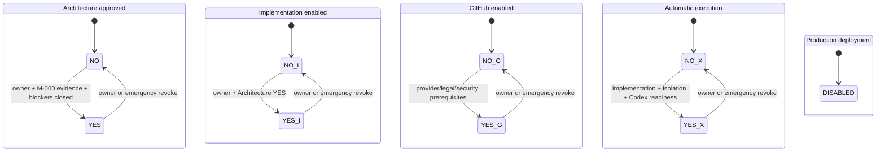

Guard principles:

- production has no transition to enabled in V1;
- enabling needs fresh owner reauthentication and immutable prerequisite evidence;
- disabling is always available and blocks new work immediately;
- running write work enters cancellation after a relevant disable;
- read-only evidence preservation may finish if it cannot create an external side effect;
- gate checks occur at command, job claim, cell start, credential issue, adapter dispatch, and reconciliation.

Decision D-020 makes high-assurance owner transitions eligible only after Windows Hello and an independent FIDO2 key are both active. The command must carry a successful WebAuthn assertion no more than five minutes old, an unexpired rotated session, a valid CSRF binding, and the expected aggregate/policy versions. Losing or revoking either authenticator disables high-risk transitions until compliant recovery or replacement completes.

## 3. Planning Process

The planning lifecycle uses a `ProcessInstance` that coordinates separate one-task workflow executions.

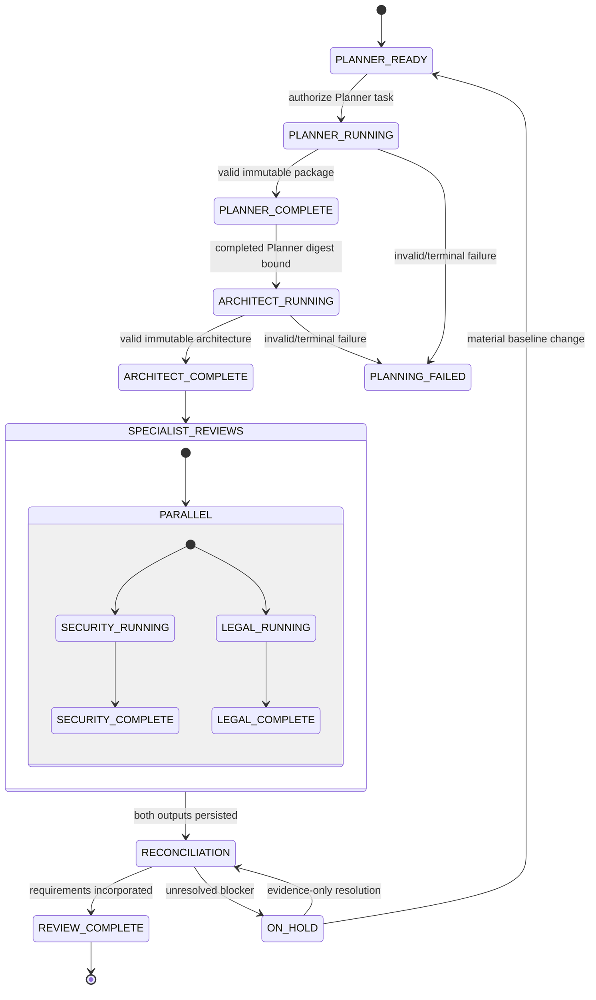

No downstream planning task may be queued before its predecessor's committed completion. Security and Legal use the same architecture digest.

## 4. Project Lifecycle

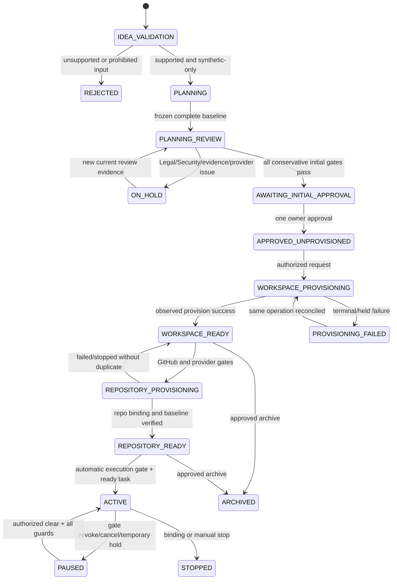

`ProjectHold` is an overlay and takes precedence over the phase. Archive/delete semantics remain D-027.

## 5. Initial Approval Guard

`CanGrantInitialApproval` is true only when:

- actor is the sole active owner with fresh high-assurance authentication;
- project is in `AWAITING_INITIAL_APPROVAL`;
- the frozen baseline has specification, architecture, roadmap, and task set;
- Planner, Architect, Security, and Legal sequence completed for that exact digest;
- Security review has no critical or unclassified finding and no Security architecture blocker;
- Legal status is effective `PASS`, or `PASS_WITH_REQUIREMENTS` with every requirement verified;
- no `BLOCK`, `COUNSEL_REQUIRED`, `LEGAL_UNRESOLVED`, evidence-integrity, prohibited-data, provider, or emergency hold applies;
- no prior initial approval exists;
- expected project/baseline/policy versions match.

The conservative D-032 policy applies until the owner approves another policy: planning `BLOCK`, `COUNSEL_REQUIRED`, critical, unclassified, or unresolved findings prevent approval, workspace, and automated execution.

## 6. Milestone State

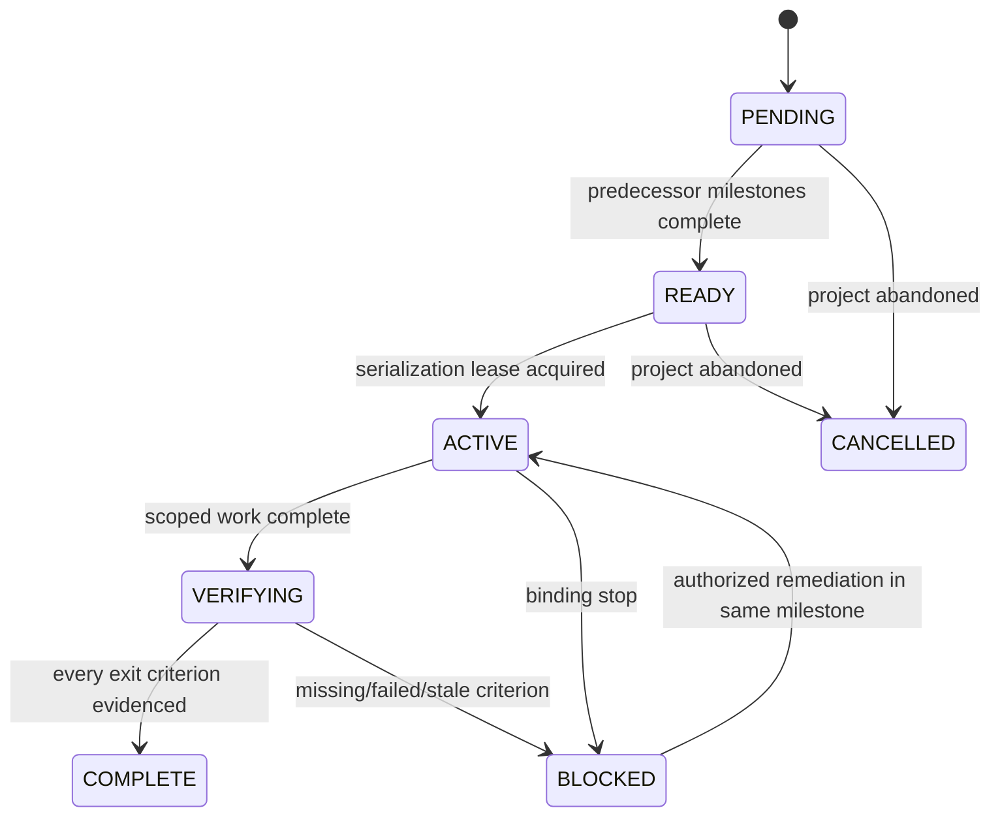

Selected D-003 behavior is one active milestone per project plus a platform-global emergency stop. The current M-000 planning workflow retains its conservative platform-global lock until the database-backed lock exists.

## 7. One-Task Workflow Execution

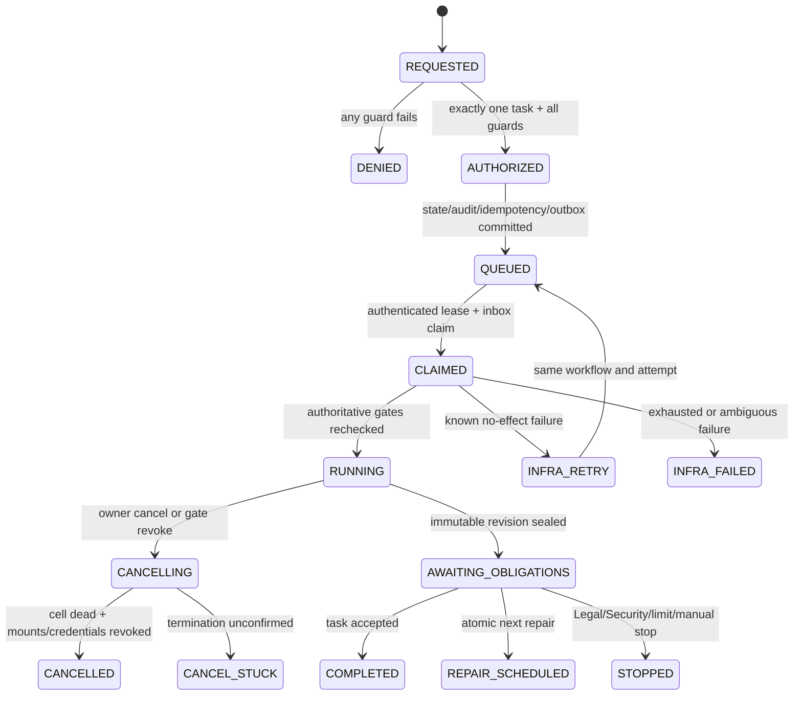

A workflow can never attach a second task. A multi-task lifecycle uses `ProcessInstance` and multiple workflow rows.

## 8. Start-Execution Guard

`CanStartExecution` requires:

- Builder architecture and implementation gates `YES`;
- automatic execution gate `YES`;
- exactly one supplied task and state `READY`;
- current milestone `ACTIVE` and predecessors accepted;
- valid one initial project approval and `WORKSPACE_READY`;
- project state is `REPOSITORY_READY` with the selected dedicated-private-organization baseline and no configuration drift;
- no active task slot, writer lease, stuck cancellation, or incompatible hold;
- current Codex provider contract/transfer assessment under D-029;
- approved SDK/runtime, isolation, credential, toolchain, network, dependency, secret, and resource policies;
- no suspected customer data or secret in the task context;
- expected project/task/policy versions match.

## 9. Task and Attempt States

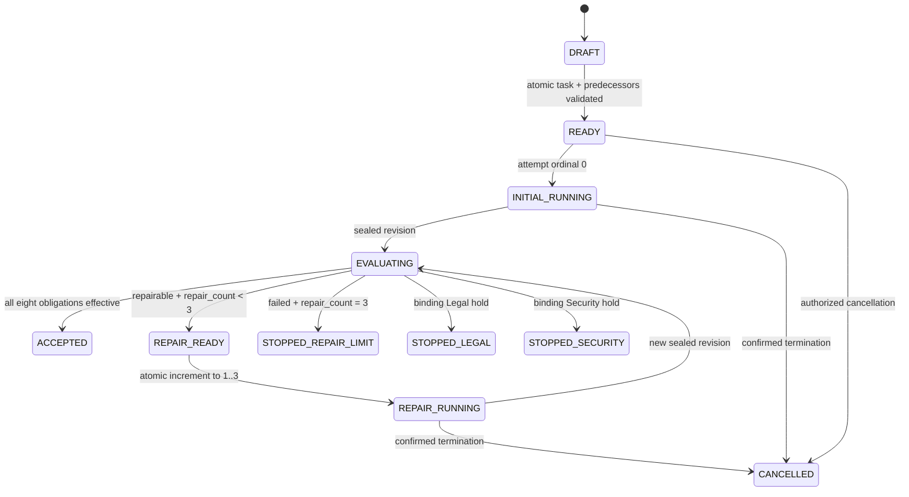

Attempt states:

`CREATED -> WAITING_FOR_LEASE -> RUNNING -> OUTPUT_PENDING -> SEALED -> EVALUATING -> SUCCEEDED | FAILED_REPAIRABLE | FAILED_TERMINAL | CANCELLED | INFRA_FAILED`.

Only `FAILED_REPAIRABLE` can schedule a repair.

## 10. Three-Repair Transaction

In one serializable transaction:

1. lock task and current attempt;
2. confirm the attempt is terminal `FAILED_REPAIRABLE`;
3. confirm no open attempt, cancellation, binding hold, or newer task version;
4. confirm `repair_count < 3`;
5. increment the count exactly once;
6. insert one repair attempt with ordinal equal to the new count;
7. insert audit, idempotency result, and outbox row;
8. commit.

Database checks reject ordinal greater than `3`. Duplicate commands return the existing ordinal. Crash after commit redelivers the same attempt; crash before commit creates no attempt. Restore or manual decision cannot rewrite the count.

## 11. Writer Lease and Fencing

Lease acquisition:

1. authorize `EXECUTOR` or explicit `QA_WRITER` mode;
2. prove no active project writer and no unconfirmed old cell;
3. atomically insert active lease and monotonic fence token;
4. Workspace Manager grants the only RW mount for that token;
5. every write, seal, revoke, and promotion validates the token;
6. heartbeat extends a bounded expiry;
7. expiry never suffices for reuse;
8. new lease requires proof of cell death, mount/capability revocation, and state reconciliation.

A partitioned stale writer cannot seal or promote after a newer fence. Canonical promotion is compare-and-swap against expected base and accepted output digests.

## 12. Cancellation

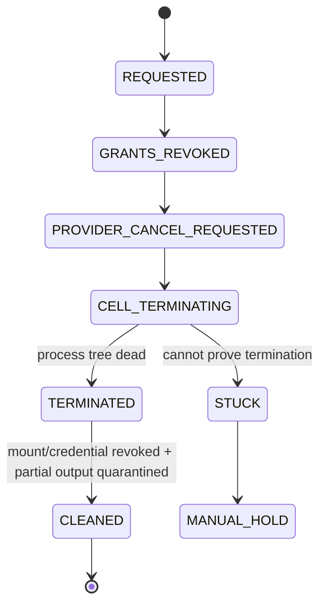

`CANCELLED` means termination is proven. A disconnected stream or provider acknowledgement alone is insufficient.

For background-job Completion/Cancellation races, the normative `DEVELOPMENT_ONLY` contract is `CANCELLATION-CONTRACT-DECISION-01` in `docs/architecture/cancellation-contract-decision-01.md`: the successful commit under the shared job-row lock and CAS/version is the linearization point; terminal `SUCCEEDED` is monotone; Cancellation committed first rejects every later success as `LATE_RESULT_DISCARDED`; and `CANCELLED` requires structured, scope-/job-/generation-bound `RuntimeTerminationEvidence` accepted by the common verifier. Status strings such as `PROCESS_TERMINATED` or `RECOVERY_CONFIRMED` are not proof. Missing proof remains `CANCELLING` or, after the prescribed final reconciliation and exhausted budget, `CANCEL_STUCK`/`MANUAL_HOLD`.

Selected MVP targets are 10 seconds p95 for cooperative cancellation and 60 seconds p95 for forced QEMU guest termination. A confirmed cancelled partial output is quarantined for at most 24 hours unless a Security/Legal incident hold applies; unconfirmed termination enters `MANUAL_HOLD` and blocks another writer.

## 13. Quality and Review Obligations

Sealing a revision atomically creates eight obligations:

- `TEST`
- `TYPECHECK`
- `LINT`
- `BUILD`
- `QA_REVIEW`
- `REVIEWER_REVIEW`
- `SECURITY_REVIEW`
- `LEGAL_REVIEW`

Selected D-031 ordering runs the four trusted quality checks first. Only an eligible unchanged revision proceeds to the four parallel read-only reviews. The eight obligations still belong to the same revision and any source change recreates all eight.

Obligation states:

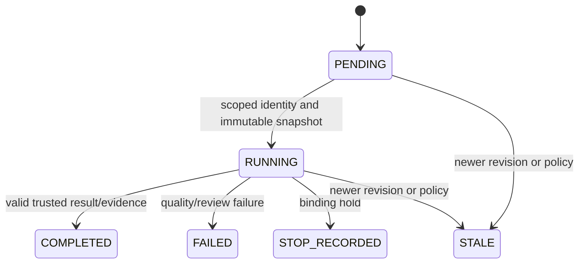

Acceptance requires all four checks `PASS`, QA and Reviewer `PASS`, effective Security, effective Legal, the same revision digest, current policies, trusted attesters, and no incompatible hold.

## 14. Legal Assessment and Requirements

`LegalAssessment` finalization:

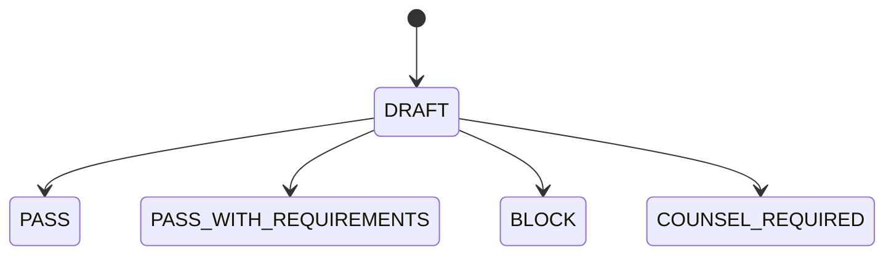

No other or null final status is accepted.

Requirement states:

`OPEN -> EVIDENCE_SUBMITTED -> VERIFIED | REJECTED`, with `SUPERSEDED` through a successor assessment only.

Effective predicates:

- `PASS`: effective only for the bound facts, scope, jurisdiction, legal date, and digest.
- `PASS_WITH_REQUIREMENTS`: effective only when every requirement is current and Legal-verified.
- `BLOCK`: creates continuation and publication holds.
- `COUNSEL_REQUIRED`: creates publication and interim automation holds plus a `CounselCase`.
- missing, stale, or conflicting assessment: creates `LEGAL_UNRESOLVED_HOLD`.

Counsel evidence does not mutate an assessment. Qualified counsel closes the case; Legal then issues a successor assessment.

## 15. Security Finding Lifecycle

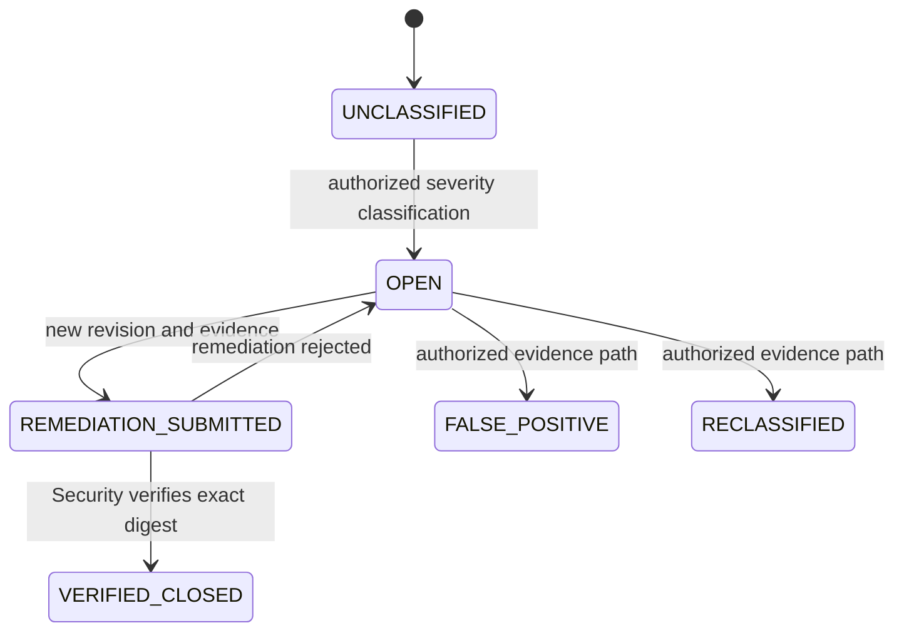

`UNCLASSIFIED`, open critical, and critical remediation-pending findings block publication. Owner risk acceptance cannot clear them. D-014 defines severity/downgrade authority.

Selected D-014 uses CVSS v4 as a scoring aid. A workspace boundary escape, cross-project access, reusable credential disclosure, audit forgery, or production-path creation is critical regardless of numeric score. Only Security may issue an evidenced reclassification or false-positive successor event.

## 16. Provider and Transfer Gate

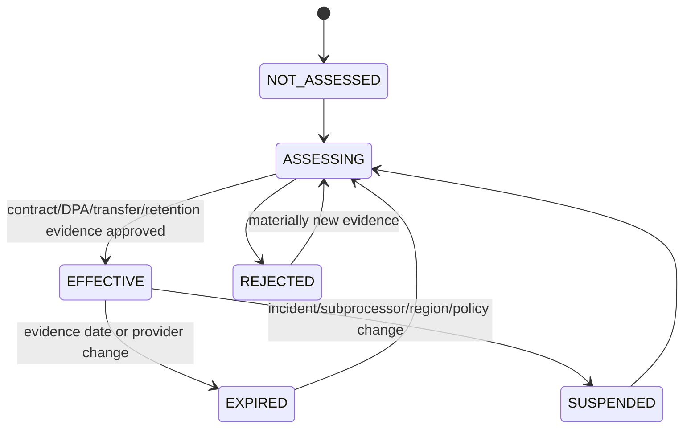

No project byte is sent to OpenAI, GitHub, or another processor unless the exact provider product/use has an `EFFECTIVE` assessment. Expiry disables new dispatch and opens a hold.

## 17. Publication and Handoff Gate

Classification:

- `INTERNAL_CONTROLLED`: only owner and bound processors/reviewers within approved contracts;
- `EXTERNAL_PROCESSING`: transfer to a specifically approved provider;
- `PUBLICATION_RELEASE`: access outside that controlled circle, including public repo, shared preview, package/release, customer handoff, app listing, open-source release, or live service;
- `PRODUCTION`: live production operation, always prohibited in V1;
- `UNKNOWN`: denied.

Under selected D-016, a private push to the dedicated GitHub organization is `EXTERNAL_PROCESSING`; a public repository, shared preview, package/release, customer handoff, or open-source release is `PUBLICATION_RELEASE`. The selected MVP permits no hosted preview or deployment and only a local encrypted owner export.

`CanPerformPublicationLikeAction` is false when:

- class is `PRODUCTION` or `UNKNOWN`;
- Legal is missing, stale, `BLOCK`, `COUNSEL_REQUIRED`, or has unmet requirements;
- critical or unclassified Security finding is open;
- revision lacks eight current obligations;
- provider/transfer/release profile is ineffective;
- GitHub/handoff capability is disabled;
- repository/target configuration has unresolved drift;
- direct or indirect production trust is detected.

## 18. External Operation

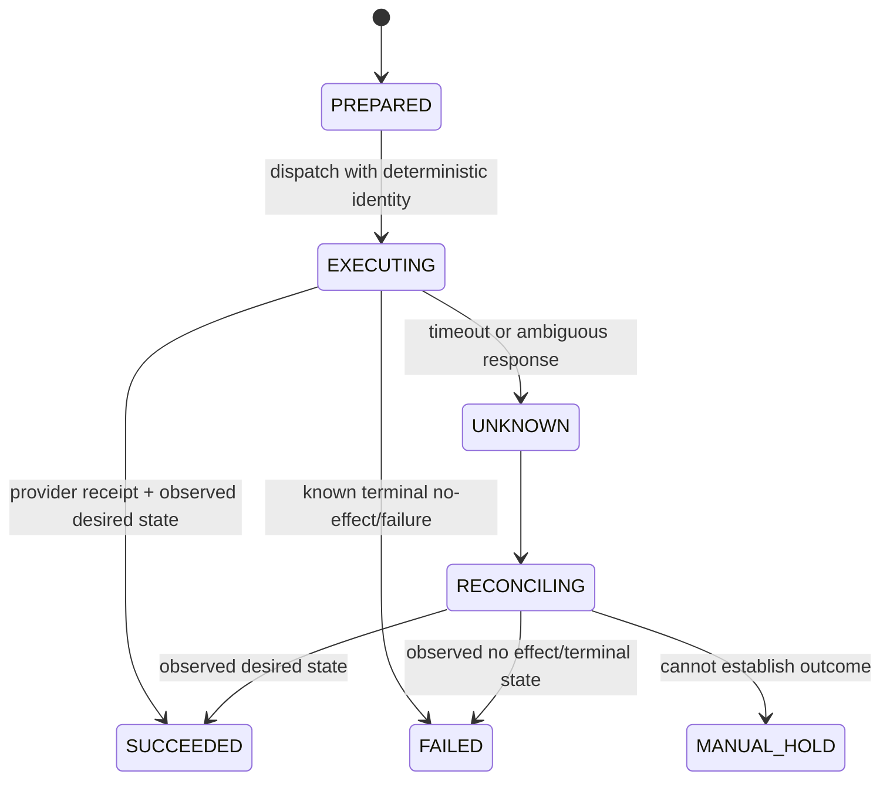

There is no blind retry from `UNKNOWN`.

## 19. Workspace Lifecycle

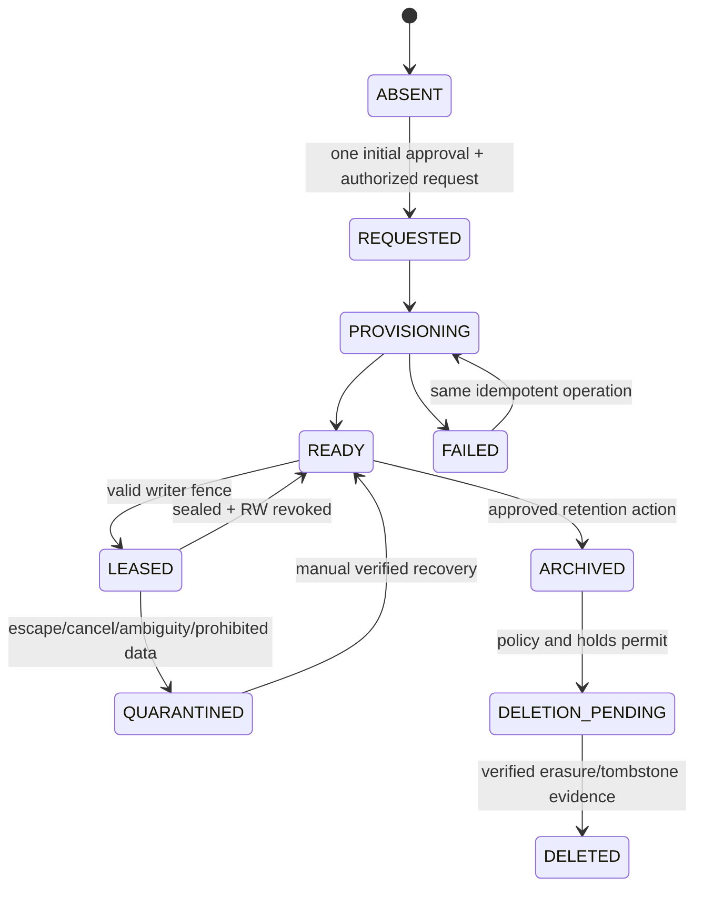

No transition out of `ABSENT` is possible before approval.

Selected D-027 applies a 7-day local soft-delete before crypto-erasure when no hold exists. Encrypted backup copies expire within 30 days; minimized audit evidence remains for 12 months. GitHub archive/delete is never an automatic workspace transition and requires a separate owner-authenticated external operation.

## 20. Backup and Restore State

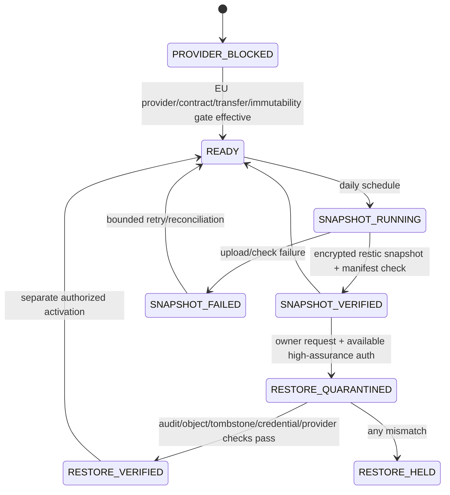

D-020 fresh WebAuthn authentication is required for restore initiation and activation. Target RPO is 24 hours and RTO is 8 hours after the provider gate and restore drill pass.

## 21. Repository State and Drift

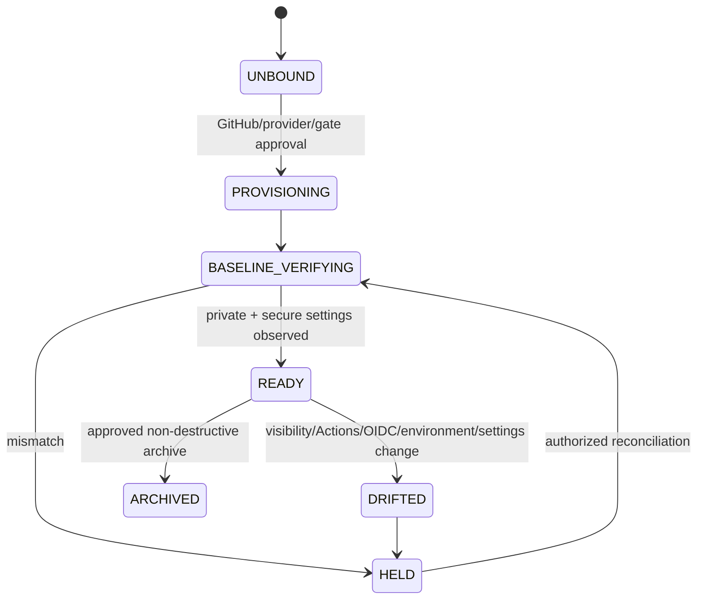

Push and publication-like operations require `READY` immediately before dispatch.

## 22. Retry Classification

| Failure | Action | Repair consumed? |
|---|---|---:|
| Queue duplicate | Inbox dedupe | No |
| Worker crash before known effect | Same job/attempt bounded retry | No |
| Transient known no-effect infrastructure failure | Same operation with backoff | No |
| Unknown external effect | Reconciliation | No |
| Codex crash without sealed revision | Same attempt only if exclusivity and clean recovery proven; otherwise infra fail | No |
| Quality/review failure on sealed revision | New repair if repairable and count below 3 | Yes |
| Legal `BLOCK` | Stop | No automatic repair |
| `COUNSEL_REQUIRED` | Counsel hold | No automatic repair |
| Critical Security issue | Policy-authorized constrained remediation may use next repair | Yes if source changes |
| Failed repair ordinal 3 | Repair-limit stop | No fourth attempt |

## 23. Reconciliation

Reconciliation checks:

- outbox/inbox/job divergence and authenticated producer identity;
- DB writer lease versus actual cell/mount/fence;
- attempt state versus sealed digest;
- evidence metadata, object digest, checkpoint, and anchor;
- current revision versus all eight obligations;
- repair count versus attempt ordinals;
- provider assessment expiry;
- external-operation desired versus observed state;
- GitHub binding and secure-settings drift;
- disabled gate versus queued/running/external work;
- Legal/Security holds versus acceptance/publication;
- deletion tombstones versus restored data.

Reconciliation may requeue the same idempotent operation, stop, quarantine, or alert. It never fabricates PASS, clears holds, resets repairs, or authorizes a provider.

## 24. State-Machine Acceptance Tests

1. Enumerate every documented edge and prove every undocumented edge is denied.
2. Exercise stale aggregate and policy versions.
3. Duplicate every command and queue delivery.
4. Crash before and after every transaction/outbox boundary.
5. Race two approvals, two writers, and two repair schedules.
6. Attempt ordinal `4` through API, queue, direct domain call, restore, and manual path.
7. Change one source byte after each quality/review result.
8. Revoke each capability between command, claim, credential issue, dispatch, and completion.
9. Expire provider evidence during queued work.
10. Inject missing, fifth, stale, and conflicting Legal statuses.
11. Exercise unclassified, critical, false-positive, reclassification, and remediation paths.
12. Simulate audit/evidence rollback and backup restore.
13. Simulate GitHub timeout, duplicate create, visibility/Actions/OIDC drift, and malicious workflow.
14. Prove production and unknown targets have no transition or capability path.
