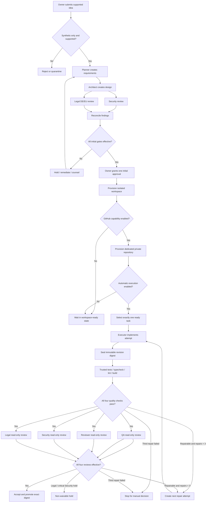

# Builder Platform V1 User Flows

Status: `PROPOSED - NO EXECUTION AUTHORIZED`

The V1 human actor is the sole Platform Owner. Agent roles are workflow participants, not independent authorities. Every flow fails closed on missing, stale, or conflicting evidence.

## 1. End-to-End Flow

## 2. Flow Rules

1. Planning roles execute in the mandated order; only Security and Legal may overlap.
2. The one initial approval binds the exact frozen planning baseline.
3. No generated-project filesystem or local repository exists before approval.
4. A workflow execution contains exactly one task.
5. A project holds one source-writing lease, shared by Executor and any explicitly assigned QA Writer mode.
6. A source change invalidates all earlier quality and review evidence.
7. Infrastructure retry repeats the same attempt; a repair creates a new ordinal and revision.
8. Repair ordinals are `1..3`; no automatic ordinal `4` exists.
9. Agents never directly call the control database, GitHub, secret broker, or deployment target.
10. `BLOCK`, `COUNSEL_REQUIRED`, critical Security, unclassified Security, and unresolved Legal data create fail-closed holds as defined by policy.

### Owner Authentication and Recovery

1. The local Builder exposes one TLS-protected loopback origin and no LAN listener.
2. Bootstrap completes only after the sole owner enrolls Windows Hello and one independent FIDO2 hardware key.
3. Ordinary sessions expire after 15 minutes idle or 8 hours absolute and rotate after authentication and privileged actions.
4. Initial approval, capability/provider/GitHub changes, export, deletion, recovery, authenticator changes, and emergency re-enable require a WebAuthn assertion no more than five minutes old.
5. Loss of one authenticator requires the other for replacement. Loss of both stops high-risk actions and requires an audited local break-glass rebuild; an old session cannot authorize recovery.
6. Passwords, recovery questions, emailed recovery links, and stored recovery codes do not exist in V1.

## 3. User Stories

### US-001 Submit a Supported Idea

As the owner, I want to submit a software idea so that a controlled project can begin.

Acceptance criteria:

- A supported full-stack web idea creates a distinct project in planning state without an executable workspace.
- Mobile-only, desktop-only, or unsupported stack requests are rejected.
- Text is bounded and screened before persistence for secrets and probable real customer data.
- Suspected prohibited data is not sent to any agent, log, evidence store, or external provider.
- The owner sees the rejection or quarantine reason without the prohibited content being repeated.

Trace: FR-001, FR-006, FR-022, FR-024, LGL-B04, SEC-B-006.

### US-002 Generate the Planning Baseline

As the owner, I want a complete planning baseline so that the project can be evaluated before approval.

Acceptance criteria:

- Specification, architecture, roadmap, and task set are versioned and share one baseline digest.
- Each task is independently actionable and suitable as the only task in one execution.
- Missing artifacts block review and approval.
- Planning artifacts are stored in control-plane evidence storage, not an executable project workspace.
- Any material baseline change creates a successor baseline and invalidates prior review effectiveness.

Trace: FR-002, FR-004, FR-006, FR-009, D-002, D-007.

### US-003 Enforce Planning Role Order

As the Orchestrator, I want specialist work in the mandated order so that every review uses completed upstream inputs.

Acceptance criteria:

- Architect work cannot be authorized before Planner completion.
- Security and Legal cannot be authorized before architecture completion.
- Security and Legal may run in parallel against the same architecture digest.
- Initial approval remains unavailable until both outputs are persisted and reconciled.
- Queue forgery or stale state cannot bypass the order.

Trace: FR-003, FR-004, NFR-008, GAC-001.

### US-004 Resolve Planning Holds

As the owner, I want planning findings made explicit so that approval cannot hide unresolved risk.

Acceptance criteria:

- Every Security and Legal requirement has an owner, state, evidence reference, and reviewed digest.
- `PASS_WITH_REQUIREMENTS` is ineffective while any requirement is open or rejected.
- `BLOCK`, `COUNSEL_REQUIRED`, critical, unclassified, and conflicting findings create the correct holds.
- A new artifact digest makes prior review evidence stale.
- Only qualified counsel evidence plus a successor Legal assessment resolves a `CounselCase`.

Trace: FR-018..021, LGL-B01, LGL-B10, SEC-B-004.

### US-005 Grant One Initial Project Approval

As the owner, I want to approve one frozen reviewed project baseline so that provisioning may begin.

Acceptance criteria:

- Approval is unavailable until all mandatory artifacts and planning reviews are current and effective.
- The owner freshly reauthenticates with phishing-resistant authentication.
- The approval records owner, baseline digest, policy versions, time, and immutable evidence.
- A second `INITIAL_PROJECT` approval is rejected by the domain and database.
- Later Legal or Security holds remain effective.

Trace: FR-004..006, FR-021, SEC-B-005, NFR-007.

### US-006 Provision an Isolated Workspace

As the owner, I want an approved project to receive one isolated workspace so that projects cannot interfere.

Acceptance criteria:

- Provisioning is denied without a valid initial approval and current policy.
- The Workspace Manager generates opaque host paths and creates exactly one project-scoped canonical workspace.
- Duplicate delivery returns or reconciles the same logical workspace.
- Negative tests cannot cross project filesystem, process, cache, artifact, log, credential, or network boundaries.
- Failure or cancellation revokes credentials and mounts and either cleans or quarantines resources.

Trace: FR-007, FR-029, NFR-001, SEC-B-001, SEC-B-006.

### US-007 Provision a Dedicated GitHub Repository

As the owner, I want one authorized private repository per project so that history remains isolated.

Acceptance criteria:

- The action is denied while the GitHub gate is disabled or provider/legal evidence is ineffective.
- The owner freshly reauthenticates before the external action.
- A GitHub App performs an idempotent brokered operation with a short repository-scoped token.
- The repository belongs to the approved dedicated account/organization and starts private.
- Actions, Pages, releases, packages, OIDC production trusts, production environments, deploy keys, and production webhooks are absent or denied by the approved baseline.
- An uncertain provider response is reconciled before retry.

Trace: FR-008, FR-025, FR-026, FR-031, SEC-B-003, LGL-B03.

### US-008 Execute One Task with Codex

As the owner, I want Codex to implement one selected task so that each change is bounded and reviewable.

Acceptance criteria:

- Zero-task and multi-task requests are rejected.
- Architecture, implementation, automatic-execution, project approval, workspace, milestone, provider, and policy guards all pass.
- Codex receives one signed task manifest and no unrelated project context, secret, customer data, or production information.
- Reusable provider authentication stays outside the hostile cell.
- The agent cannot expand its own tools, network, budget, task, or acceptance authority.
- The pinned SDK must pass hostile-child, cancellation, session-isolation, and environment conformance tests.

Trace: FR-009, FR-010, FR-025, FR-031, SEC-B-002, D-008, D-029.

### US-009 Enforce the Single Writer

As the Orchestrator, I want every source writer serialized so that revisions and reviews remain coherent.

Acceptance criteria:

- A partial unique constraint permits one active project writer lease.
- Every RW mount and promotion checks the current monotonic fence token.
- Lease expiry alone never authorizes reuse; prior cell death and mount revocation are proven.
- Executor and QA Writer use the same lease system.
- A QA Writer cannot create the QA review decision for its own revision.
- A stuck cancellation blocks the next writer.

Trace: FR-011, FR-012, NFR-002, NFR-003, D-004, D-013.

### US-010 Run Trusted Quality Checks

As QA, I want reproducible quality evidence so that agent claims cannot be mistaken for success.

Acceptance criteria:

- A trusted supervisor runs the signed versioned test, typecheck, lint, and build manifest without unsafe shell interpolation.
- Each result records exact revision, runner image, toolchain, manifest, policy, exit status, limits, and evidence digest.
- Cell stdout, model JSON, or self-reported PASS is never authoritative evidence.
- A missing required command or unsupported toolchain fails closed.
- Any changed byte, command, image, or relevant policy makes prior evidence ineffective.

Trace: FR-013, FR-015, NFR-010, SEC-B-007, D-012.

### US-011 Obtain Four Required Reviews

As the owner, I want every revision reviewed by QA, Reviewer, Security, and Legal so that acceptance covers all disciplines.

Acceptance criteria:

- Sealing a revision atomically creates four role-specific review obligations.
- Each reviewer receives only an immutable read-only snapshot and scoped evidence capability.
- Decisions bind the exact revision and policy version.
- Missing, stale, self-authored, or conflicting decisions cannot satisfy acceptance.
- All four reviews repeat after any source change.

Trace: FR-014, FR-015, NFR-008, D-031.

### US-012 Repair a Failed Task

As the Orchestrator, I want bounded repairs so that automation cannot loop indefinitely.

Acceptance criteria:

- The initial attempt is ordinal `0` and does not consume a repair.
- A serializable transaction increments the counter and creates exactly one repair ordinal.
- Duplicate commands return the existing repair attempt.
- Infrastructure retries retain the current attempt ID and do not consume a repair.
- Every repair creates a new revision and repeats all eight obligations.
- After unsuccessful ordinal `3`, no automatic execution can start for that task.

Trace: FR-016, FR-017, NFR-009, GAC-009.

### US-013 Make a Manual Decision after Repair Limit

As the owner, I want explicit options after three failed repairs so that the history cannot be reset silently.

Acceptance criteria:

- The task enters `STOPPED_REPAIR_LIMIT` and creates an owner notification.
- A manual decision records reason and evidence and cannot reset the existing repair counter.
- Permitted choices are defined by D-017; none waives Legal, Security, or production holds.
- New scope becomes a new versioned task rather than an automatic fourth repair.
- Imported manual remediation becomes a new revision and receives all eight obligations.

Trace: FR-017, FR-021, D-017, D-025.

### US-014 Enforce Legal Decisions

As Legal DE/EU, I want exact revision-bound statuses so that Legal gates are deterministic.

Acceptance criteria:

- Only the four specified statuses are accepted.
- Each assessment records scope, facts, assumptions, jurisdiction, legal date, sources, reviewer type, and digest.
- `PASS_WITH_REQUIREMENTS` becomes effective only after Legal verifies every requirement.
- `BLOCK` and `COUNSEL_REQUIRED` create non-waivable holds.
- Provider, AI Act, IP/OSS, release-profile, transfer, retention, and counsel gates are evaluated where applicable.

Trace: FR-018, FR-019, LGL-B01..B10.

### US-015 Enforce Critical Security Stops

As Security, I want critical and unclassified findings to stop publication so that unsafe revisions cannot ship.

Acceptance criteria:

- A new finding begins unclassified and blocks until classified.
- Critical findings create an immediate publication hold.
- Owner approval and ManualDecision cannot clear the hold.
- Remediation produces a new digest and new Security assessment.
- False-positive or severity-change decisions require authorized Security evidence under D-014.

Trace: FR-020, FR-021, SEC-B-004, D-014.

### US-016 Audit and Recover a Project

As the owner or auditor, I want complete, minimized, tamper-evident history so that decisions and failures can be reconstructed lawfully.

Acceptance criteria:

- Audit reconstructs baseline, approval, task, attempts, repair counter, revisions, checks, reviews, holds, external operations, and manual decisions.
- Ordered checkpoints are signed and anchored outside the ordinary audit writer's administration boundary.
- A sequence gap, rollback, corrupt/missing evidence, or restore divergence creates a hold.
- Audit content excludes source, raw prompts, secrets, prohibited customer data, and unnecessary personal data.
- Restore occurs in quarantine and revalidates evidence, leases, credentials, provider bindings, deletions, and current gates before workers resume.

Trace: FR-028, FR-029, NFR-007, NFR-012, SEC-B-004, LGL-B05.

## 4. Exception Flows

| Trigger | Required result |
|---|---|
| Unsupported project type | Reject before agent work |
| Suspected customer data or secret | Reject/quarantine, do not log, do not transmit, open incident process if persisted |
| Missing planning artifact | Keep planning incomplete |
| Planning Legal `BLOCK` | Stop continuation and publication |
| Planning `COUNSEL_REQUIRED` | Create `CounselCase`; hold approval, workspace, execution, and publication under the conservative policy |
| Critical/unclassified planning finding | Hold initial approval and execution |
| Worker/queue duplicate | Return prior idempotent result or process same attempt |
| Unknown external side effect | Enter reconciliation; never blind retry |
| Provider contract or transfer evidence expires | Disable the affected external-processing gate and hold queued work |
| Writer termination unconfirmed | `CANCEL_STUCK`; no next writer |
| Revision changes after evidence | Mark all earlier obligations ineffective |
| Third repair fails | Stop for manual decision; no automatic fourth repair |
| GitHub settings drift toward publication/production | Hold pushes and reconcile configuration |
| Production or unknown deployment target | Reject at schema, domain, IAM, and network layers |

## 5. Owner Notifications

The owner inbox must distinguish information from decisions. No timeout or notification acknowledgement implies approval. It covers:

- approval ready;
- requirement or evidence missing;
- Security or Legal hold;
- `COUNSEL_REQUIRED`;
- task validation failure;
- repair ordinal and remaining count;
- repair-limit stop;
- stuck cancellation;
- uncertain provider operation;
- provider/legal/security evidence expiry;
- suspected secret or prohibited data;
- attempted production or gate bypass.

Channels, response targets, escalation times, and retention are defined by D-025.
